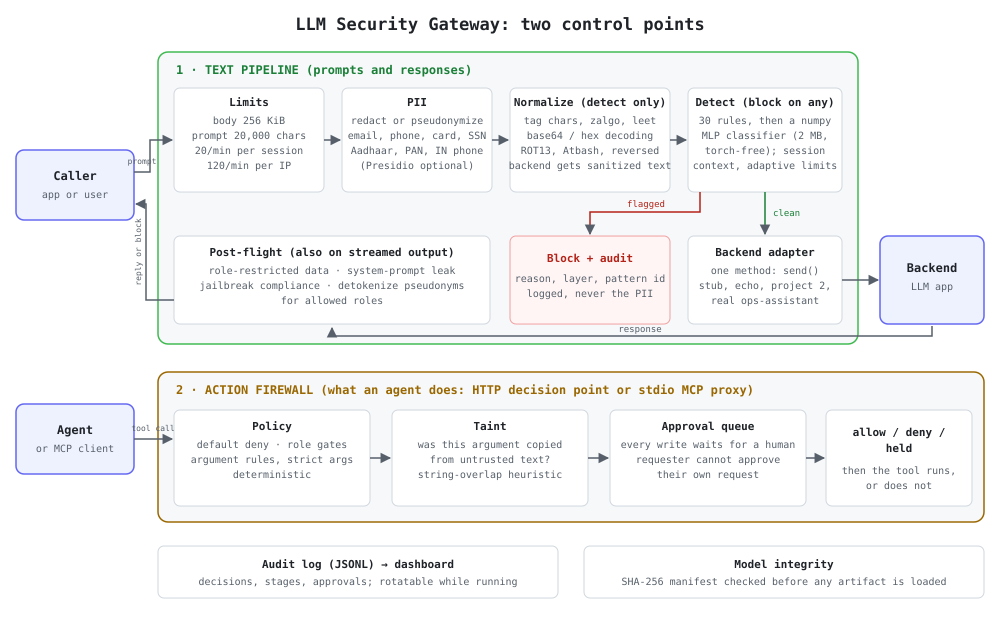

# LLM Security Gateway


&nbsp;·&nbsp; **[Live demo →](https://llm-security-gateway-psax.onrender.com/gateway/demo)**
&nbsp;·&nbsp; [Live dashboard →](https://llm-security-gateway-psax.onrender.com/gateway/dashboard)

Standalone security middleware for LLM applications. Sits between a caller and any
LLM backend and inspects traffic both directions — prompt injection, PII leakage,
jailbreak-compliance, role-inappropriate data exposure. Structurally like an
nginx/Envoy reverse proxy, except the checks are LLM-specific instead of generic
auth/rate-limiting.



**What it demonstrably does:** with the gateway bypassed, a naive backend complies
with attacks in the hand-built corpus. With the gateway in front, attacks are
handled correctly end-to-end over a live FastAPI service — not an in-process call.
The value is the *ensemble* (defense-in-depth), not any single layer; the honest
per-layer numbers, including a train/test leakage bug that was found and fixed, are
in [Detection layer comparison](#detection-layer-comparison-the-actual-centerpiece)
and [`HIGHLIGHTS.md`](HIGHLIGHTS.md).

---

## Try it in 60 seconds

```bash
docker compose up --build          # full pipeline (rules + classifier + post-flight checks), no external services
# open http://localhost:8000/gateway/demo
```

Pick an attack, pick a backend, hit **Run** — the same prompt goes straight at the
backend and through the gateway, side by side, with the verdict, which layer fired,
and latency for each. Other run modes (Render free tier, the end-to-end trilogy
with the real Project 2 RAG agent behind it) are in [`DEPLOY.md`](DEPLOY.md).

> The public link above and `docker compose up` run the **identical ensemble**:
> rule-based + the scratch classifier (block-on-any). The TF-IDF similarity layer was
> **retired from the default on 2026-09-25** after an ablation showed it added nothing on
> this project's own corpus ([`docs/ensemble-ablation.md`](docs/ensemble-ablation.md)); it
> remains an opt-in ablation (`EMBEDDING_BACKEND=tfidf`). The classifier used to be dropped on the free
> 512 MB host because it was torch-backed; it's now served torch-free by
> `gateway/detectors/classifier_numpy.py`, a bit-parity-verified re-implementation
> of the trained model's forward pass — see `docs/decisions.md`.

---

## Architecture

See [`docs/architecture.svg`](docs/architecture.svg) above. In text:

```
Caller → Gateway
  ├─ 1. Pre-flight
  │    ├─ PII detection/redaction        (gateway/pii.py)
  │    ├─ Prompt-injection ensemble       (gateway/detectors/*, rule-based + classifier by default, block-on-any; TF-IDF layer opt-in)
  │    ├─ Per-session rate limiting       (gateway/session_checks.py)
  │    └─ Session-behavior anomaly check  (gateway/session_checks.py)
  ├─ 2. If clean → forward to backend adapter (gateway/adapters/*)
  ├─ 3. Post-flight
  │    ├─ Role-based data exposure check  (gateway/role_exposure.py)
  │    ├─ Jailbreak-compliance detection  (gateway/response_checks.py)
  │    └─ System-prompt leak check        (gateway/response_checks.py)
  └─ 4. Log everything, return allow/block + response  (gateway/logging_schema.py)
```


**Pluggability:** backends implement one method — `send(prompt, session_id, role) -> str`
(see [`gateway/adapters/base.py`](gateway/adapters/base.py)). Dropping the gateway in
front of a different LLM app means writing one small adapter class, not editing the
gateway itself. Demonstrated with three structurally unrelated backends (see
[Proof requirements](#proof-requirements)).

**Project 2 integration (best-effort guess):** `project2_agent/` is a reconstruction
of Project 2 built from a one-paragraph description in the build doc — its real code
was not available when it was written (the real service is now wired in as the
`operations_assistant` backend — see [`DEPLOY.md`](DEPLOY.md)). See
[`docs/project2_agent_notes.md`](docs/project2_agent_notes.md) for the full design
and, importantly, a real evaluation-methodology finding it surfaced: a strict
pass/fail metric can't distinguish "the gateway blocked this attack" from "nothing
recognized this as an attack, but the backend happened not to understand it either."
Replace this package wholesale once the real Project 2 codebase exists.

**Tier 3 additions:**
- **Adaptive thresholding** (`gateway/adaptive_threshold.py`) — a per-session risk
  score tightens the embedding-similarity and classifier thresholds after prior blocks
  in that session. Proven with a real before/after: the same borderline text is
  allowed for a clean session and blocked for a session that already triggered two
  prior blocks.
- **Streaming support** (`process_streaming`, `POST /gateway/chat/stream`) — post-flight
  checks re-run against the growing response buffer after every chunk, not just once
  at the end. A leaky response gets cut off mid-generation.
- **Live dashboard** (`GET /gateway/stats`, `GET /gateway/dashboard`) — reads the same
  JSONL log every request already writes to. Block rate, decisions by phase, blocks by
  detection layer, recent events, auto-refreshing every 2s.

---

## Detection layer comparison (the actual centerpiece)

Run via `python scripts/evaluate.py`, scored against `corpus/injection_cases.yaml` — our own
100-case corpus (expanded: 36 → 72 on 2026-09-12, 72 → 100 on 2026-09-15;
see [`docs/corpus_expansion_result.md`](docs/corpus_expansion_result.md)),
**strictly held out from training** (see the leakage note below — this wasn't
always true, and the difference matters enormously).

| Layer | Detection rate | False-positive rate | Avg latency (ms) |
|---|---|---|---|
| rule_based | 27% (21/78) | 6% (1/17) | 0.262 |
| embedding_similarity (TF-IDF; opt-in ablation, **disabled by default since 2026-09-25**) | 0% (0/78) | 0% (0/17) | 23.643 |
| embedding_similarity_st (sentence-transformer, opt-in) | 23% (13/56)* | 0% (0/12)* | 47.443 |
| scratch_classifier (in production; retrained 2026-09-22, see below) | 38% (30/78) | 12% (2/17) | 0.106 |
| distilbert_finetuned (comparison only) | 52% (29/56)* | 25% (3/12)* | 364.5† |

\* measured on 72-case corpus; not re-run on expanded corpus — see [`docs/comparison_table.md`](docs/comparison_table.md).
† single-inference CPU timing, varies run-to-run.

**Corpus composition (100 cases):** 78 block + 5 ambiguous + 17 benign — expanded:
36→72 on 2026-09-12, 72→100 on 2026-09-15, adding underrepresented attack vectors
and tripling negative-control coverage. See [`docs/corpus_expansion_result.md`](docs/corpus_expansion_result.md).
26 of the 100 are labeled `origin: public_pattern` — each mapped to a specific
named technique and real-world citation (OWASP LLM01, the Shen et al. 2024
jailbreak taxonomy, Unicode bidi-override CVEs, etc.), not just a label:
[`docs/corpus-references.md`](docs/corpus-references.md). The rest are
`self_devised`, invented for this project rather than sourced.

### Per-category breakdown (100-case corpus, attack cases only)

`scripts/evaluate.py` now reports per-category detection rates — a more
honest view than the aggregate, because the five attack categories have very
different difficulty levels:

| Category (n attacks) | rule_based | embedding_similarity | scratch_classifier (retrained) |
|---|---|---|---|
| direct_injection (13) | 46% (6/13) | 0% (0/13) | **62% (8/13)** |
| encoding_obfuscation (20) | 15% (3/20) | 0% (0/20) | 45% (9/20) |
| indirect_injection (15) | 13% (2/15) | 0% (0/15) | 47% (7/15) |
| multi_turn_jailbreak (15) | 7% (1/15) | 0% (0/15) | 27% (4/15) |
| tool_scope_escalation (15) | 60% (9/15) | 0% (0/15) | 13% (2/15) |

The classifier handles direct injection best at 62%, while rule_based leads on
**tool_scope_escalation at 60%** — thanks to targeted patterns for social-engineering
delegation ("my director asked me to"), fake-authority claims ("scheduled internal
security test"), automated bulk-export requests, and cross-user tool impersonation.
These attack types don't use injection vocabulary; they exploit legitimate-looking
business framing, which is why a distinct pattern set was needed.
The full per-category table is in [`docs/comparison_table.md`](docs/comparison_table.md).

### External benchmark (contamination-audited)

**Correction.** An earlier version of this section scored the detectors on a sample of jailbreak_llms and called it "independent of our training and eval data" (92% embedding / 97% classifier). That was wrong: `data/train.csv` is itself built from jailbreak_llms. `scripts/external_benchmark_v2.py` audits this by exact match (lowercased, whitespace-normalised): **422 of the 666 prompts (63%) are verbatim in the training positives**, and 93 of the 150 in the old sample. On those, the layers score 100% (embedding) and 97% (classifier), which is memorisation. Near-duplicates are not detected by this check, so true contamination is at least this high.

**Before retraining (v1 classifier).** Results on data the detectors did not train on (raw output as of 2026-09-20; the current numbers are further below; [`reports/p3_external_benchmark_v2.json`](reports/p3_external_benchmark_v2.json); Wilson 95% CIs in the JSON):

| Dataset | Layer | Detection (attacks) | False positives (benign) |
|---|---|---|---|
| jailbreak_llms, 244 prompts not found in training | rule_based | 15.6% | n/a |
| | embedding_similarity | 65.2% | n/a |
| | scratch_classifier | 92.6% | n/a |
| | any layer blocks | 94.7% | n/a |
| deepset/prompt-injections (cc-by-4.0, unrelated authors; 263 injections / 399 benign) | rule_based | **0.8%** | 0.0% |
| | embedding_similarity | 22.1% | 16.8% |
| | scratch_classifier | 49.4% | **39.8%** |
| | any layer blocks | 63.9% | **48.6%** |
| JailbreakBench benign behaviours (100 borderline-benign requests) | scratch_classifier | n/a | **25.0%** |
| | any layer blocks | n/a | **26.0%** |

**After retraining (2026-09-21).** The classifier was retrained on a much more diverse set (deepset train, gandalf, jackhhao, safe-guard, alpaca, dolly, plus short chat messages) with all evaluation sets held out, and now skips inputs shorter than 3 word tokens. Full method, ablation, and what did not improve: [`docs/retraining-flow.md`](docs/retraining-flow.md); raw output: [`reports/p3_shipped_heldout.json`](reports/p3_shipped_heldout.json). Ensemble = block if any layer blocks:

| Held-out set | v1 ensemble | Retrained ensemble | Note |
|---|---|---|---|
| JailbreakBench benign, false positives (n=100) | 26% | **10%** | never trained on |
| Short messages, false positives (n=40) | 22.5% | **2.5%** | |
| deepset test benign, false positives (n=56) | 55% | **25%** | same-source split: deepset train is now in training |
| jailbreak_llms not in training, detection (n=244) | 94.3% | 91.8% | small detection cost |
| deepset test, detection (n=60) | 78% | 61.7% | same-source split |
| Own corpus, detection (n=78) | 61.5% | **53.8%** | detection cost of in-domain benign training (config E) |
| **Own corpus, benign false positives (n=17)** | 23.5% | **17.6%** | **improved: 5→3 of 17 after adding in-domain procurement data (config E), interval 6-41%** |

The cleanest evidence is leave-one-source-out (train without a source, test on it): classifier ROC-AUC on deepset 0.56 to 0.71, on safe-guard 0.55 to 0.90, on jackhhao 0.91 to 0.94. Held-out splits of sources that are in training (safe-guard, jackhhao, gandalf: ~0.99 AUC) are same-distribution and overstate generalisation. Config E (adding ~170 in-domain procurement/ops benign examples) improved in-domain FP from 5→3 of 17 (29.4%→17.6%) at a detection cost: own-corpus ensemble detection dropped from 61.5% to 53.8%. Deepset FP rose slightly to 25%.

**Can recalibration fix it?** Tried, held-out: thresholds chosen on deepset's train split cut false positives to near zero only by collapsing detection (5% at 0% FP on deepset test; own-corpus detection 62% to 27%), because the raw classifier score has ROC-AUC just 0.61 there. Full step-by-step story, chart and table: [`docs/recalibration-flow.md`](docs/recalibration-flow.md).

What this means, stated plainly:

- **Generalisation is much weaker than the earlier README claimed.** On a genuinely different injection dataset the whole ensemble catches about 64% while blocking about 49% of benign prompts; the classifier alone is close to a coin flip (49% detection at 40% false positives). The rule-based layer catches almost nothing there (2 of 263), because deepset's injections are short natural-language instructions rather than the patterns it encodes.
- **The false-positive rate is the biggest problem**, not detection. The README's "~10% residual false positives" was measured on hand-written in-domain benign queries and does not transfer: 25-40% on external benign sets. As deployed, this gateway would block a large share of legitimate traffic from these distributions.
- Caveats: deepset includes German text and some short, ambiguous labels; JailbreakBench's "benign" requests are deliberately borderline (they mirror harmful topics), so a high false-positive rate there is partly a harder test; the jailbreak_llms "clean" subset may still contain near-duplicates of training data, so its 92.6% is an upper bound on true generalisation.
- The "0% internal / 92% external" narrative for `embedding_similarity` in earlier versions is withdrawn. It scores 0% on our hand-written attacks, 65% on the clean jailbreak_llms subset (likely inflated by near-duplicates) and 22% on deepset.

Two of these rows are separate experiments run to actually test a hypothesis
this project had previously only stated:

`embedding_similarity_st` swaps TF-IDF for a real `all-MiniLM-L6-v2` embedding
on the *same* known-bad index, threshold independently swept (0.35 isn't
comparable across different similarity distributions). **Confirms TF-IDF's 0%
is an architecture ceiling, not a tuning problem** — a real embedding finds
signal TF-IDF structurally can't, non-leaked, from the same public dataset. Set
`EMBEDDING_BACKEND=sentence_transformer` (opt-in; code default is `tfidf` — set at the
source in `gateway/middleware.py`, also explicit in `render.yaml`). Kept off by default because
it is still the weakest real detector (23% vs. the classifier's 48%) at ~500x the classifier's
latency, and it would re-introduce torch into the serving path this project deliberately removed
(see below).
Full writeup: [`docs/sentence_transformer_similarity_result.md`](docs/sentence_transformer_similarity_result.md).

### Guard-model baseline: why build a detector from scratch instead of using an existing one?

Measured, not argued: `python -X utf8 -m scripts.baselines.run_guard_baselines` (optional extra
`pip install -e .[baselines]`) scores `protectai/deberta-v3-base-prompt-injection-v2` and the
"ours OR guard" combination on the same held-out sets as everything else. Full table, ROC-AUC, CIs,
and the reasoning: [`docs/guard-baselines.md`](docs/guard-baselines.md); raw output:
[`reports/p3_guard_baselines.json`](reports/p3_guard_baselines.json).

| Held-out set | Ours | ProtectAI DeBERTa | Ours OR ProtectAI |
|---|---|---|---|
| **Own corpus** detection / FPR | 53.8% / 17.6% | **80.8%** / 23.5% | **85.9%** / 23.5% |
| deepset test detection / FPR | 61.7% / 25.0% | 36.7% / **0.0%** | 68.3% / 25.0% |
| JailbreakBench benign FPR | 10.0% | **1.0%** | 11.0% |
| p50 latency (CPU) | **4.1 ms** | 72.1 ms | ~76 ms |
| Weights / extra RSS | **2 MB** / small | 704 MB / **+858 MB** | both |

**Honest reading.** On the corpus this gateway was built for, the guard model is the better detector
(80.8% vs 53.8% at a similar false-positive count), and on deepset it is far more precise. Combining
them with an OR maximises recall but inherits both models' false positives, so it does not fix
precision. **What ships is still the from-scratch ensemble, for one reason: the guard model needs about
860 MB of resident memory (17.5x the latency), which cannot fit the free 512 MB instance this project
targets.** The from-scratch classifier is a defensible small/fast/torch-free engineering exercise, not
a detector to prefer over an existing guard model when memory and latency allow. Meta's Prompt Guard 2
(86M/22M) and Llama Guard were **not evaluated**: both are gated behind manual license approval and no
Hugging Face token was available.

### Action firewall: from inspecting text to authorizing actions (Phase 3)

The text layers only see prompts. `gateway/actions/` adds a second control point for what an agent *does*: a default-deny per-tool policy
(`config/tool_policies.yaml`), provenance tracking that catches write-tool arguments copied from untrusted text, a human approval queue with
separation of duties, an audit log, an HTTP decision point, and a stdio **MCP proxy** verified in front of operations-assistant's real MCP
server. On a 54-scenario agentic corpus (45 harmful, 9 benign), the firewall stopped **38 of 39** in-scope harmful scenarios outright (28 by
policy, 10 by taint) and held the last for approval at high risk; **6 known evasions** (paraphrase, encoding, translation, data via a trusted
tool) reach the approval queue. The deployed text layers detected 2 of 2 user-message attacks, blocked 5 of 52 innocuous messages, and saw none of
the indirect injections. Not CaMeL, and results are optimistic (same author as the corpus). Demo: `python -X utf8 -m scripts.demo_action_firewall`.
Full write-up, limits, and side-findings (a stored XSS in the dashboard, fixed): [`docs/action-firewall.md`](docs/action-firewall.md).

### Red-team: standard scanners plus an adaptive attacker (Phase 4)

Full pentest-style report: [`reports/redteam-2026-09.md`](reports/redteam-2026-09.md) (scope, method, tool versions, findings with OWASP LLM 2025 and
MITRE ATLAS mapping, retests, limitations). Tools: **garak 0.16.0**, **promptfoo 0.119.0**, an LLM attacker against the action firewall (Groq free tier)
and a deterministic mutation attacker. 12 weaknesses confirmed: **6 fixed and retested** (per-IP rate-limit bypass by session rotation and by a spoofed
`X-Forwarded-For`; Unicode-tag smuggling, 0 of 32 blocked before and 32 of 32 after; zalgo; the dashboard's stored XSS; backend requests silently
rewritten by the detection normaliser) and **6 open** (latent injection in quoted documents, ROT13/Atbash/reversed overrides, one classifier false positive,
and three taint-heuristic gaps). Against the action firewall, deterministic policy had **0 bypasses in 39 mutations**; the taint check was defeated by
re-tokenising an identifier (15 of 29 mutations passed, 11 of them new), and every such miss was held for approval, **none executed**. Text layers alone
let a hijacked call through on 3 of 6 goals against a naive agent, the firewall on 0 of 6. Small samples, same-author test design, and one raw run lost by
mistake are all stated in the report; the open findings are pinned as `xfail(strict)` tests. Reproduce: `redteam/README.md`.

### Retiring the dead layer, and trying to make the guard model servable (Phase 2)

The TF-IDF layer scores 0/78 on our own corpus, so it was ablated
([`docs/ensemble-ablation.md`](docs/ensemble-ablation.md), raw JSON in `reports/`). Removing it leaves own-corpus results
unchanged (42/78 detected, 3/17 false positives), cuts deepset false positives from 14/56 to 6/56 at a cost of
8 fewer attacks caught, and takes the ensemble from 4.4 ms to 0.11 ms p50. Swapping in the fp32 sentence-transformer
instead was worse (JailbreakBench benign false positives 9% to 24%). **Negative result kept:** exporting the
ProtectAI guard model to ONNX is exact and 2.5x faster than PyTorch (771 MB RSS, still too big), while int8
quantization breaks it (own-corpus detection 81% to 10-12%; per-channel and feed-forward-only variants recover to
62-64% but not fully, and still use 534-612 MB). No variant both fits 512 MB and keeps its accuracy.

### L2 threshold sweep (scripts/threshold_sweep_l2.py)

Run `python scripts/threshold_sweep_l2.py` to reproduce — sweeps both backends
at thresholds 0.05–0.95 against the current 100-case corpus (78 attacks, 17 benign; regenerated 2026-09-20 -- an earlier version of this script read a stale `data/eval.csv` export instead of the YAML corpus and is now fixed):

| Backend | Best F1 | Threshold | Detection | FP rate | Max detection at 0% FP |
|---|---|---|---|---|---|
| TF-IDF | 0.869 | 0.05 | 93.6% (73/78) | 100% (17/17) | **20.5%** at t=0.15 |
| sentence_transformer | 0.902 | 0.05 | 100% (78/78) | 100% (17/17) | **20.5%** at t=0.45 |

**The key finding:** neither backend can achieve useful precision by threshold tuning alone. At the best F1 threshold (0.05), both block almost all attacks but also block every legitimate request — precision ~0.82 (0.82 = 78 attacks / 95 total at 100% flagged). At the only threshold where FP rate = 0%, both backends catch about 20.5% of attacks. This confirms that **Layer 2 (embedding similarity) is structurally a low-precision first-pass filter in front of the classifier, not a standalone detector** — its value is catching attacks the rule-based layer misses, at the cost of false positives the classifier then adjudicates. The 3-layer ensemble's defense-in-depth design is validated: no single layer is sufficient.

Per-category breakdown at t=0.05 (both backends): direct_injection and multi_turn_jailbreak 100%, indirect_injection 100%, tool_scope_escalation 100%, encoding_obfuscation 71% (TF-IDF) / 100% (sentence_transformer). The only category where sentence_transformer beats TF-IDF at the optimal threshold is encoding_obfuscation — the obfuscated text fragments enough that TF-IDF's term-frequency signal breaks down, while sentence_transformer's contextual embedding still recognizes the semantic intent.

`distilbert_finetuned` is a real fine-tuned `distilbert-base-uncased` run,
re-scored on the expanded corpus (`scripts/rescore_distilbert.py`, inference
only, no retraining needed), scored with the exact same methodology as every
other row. **Ties the from-scratch classifier within a few points on both
metrics, at 2-3 orders of magnitude the latency** — pretrained language
understanding bought nothing over a from-scratch model trained on the same
~2,000 rows, including on the domain-shift false-positive test
(`docs/domain_shift_fix.md`). Full writeup, training run details, and the raw
eval JSON: [`docs/distilbert_finetune_result.md`](docs/distilbert_finetune_result.md).

### Paraphrase robustness & evasion hardening (scripts/paraphrase_robustness.py)

Run `python scripts/paraphrase_robustness.py` to reproduce — applies 4 surface transforms to all 83 attack cases (100-case corpus, expanded from 72) and measures per-layer detection rate with and without text normalization:

Regenerated 2026-09-20 on the 78 attack cases of the current corpus, with the served (TF-IDF) embedding backend and the raw detectors (no normalizer) unless stated. The earlier version of this script scored a stale CSV export, so the older numbers here (72-case corpus, sentence-transformer column) are replaced, not supplemented.

| Transform | rule_based | embedding (TF-IDF) | classifier | Notes |
|---|---|---|---|---|
| original | 26.9% | 0.0% | 48.7% | baseline |
| case_swap | 26.9% | 0.0% | 48.7% | no impact |
| space_insert (no normalizer) | 0.0% | 0.0% | 74.4% | rule_based fully evaded; classifier goes **up** (see below) |
| space_insert (with normalizer) | 28.2% | 0.0% | **44.9%** | rule_based restored; classifier drops |
| synonym_sub | 19.2% | 0.0% | 50.0% | minor drift for rule_based |

**A finding that contradicts an earlier claim in this README.** The previous version said the normalizer "fully restored" the classifier (9.6% to 55.3%). On the current corpus the un-normalized classifier scores *74.4%* on zero-width-space-inserted text, higher than its 48.7% baseline, and the normalizer brings it down to 44.9%. The likely reason (not separately verified) is that zero-width characters push text off the classifier's training distribution toward "attack-looking" inputs, so it blocks more, including things it would otherwise miss; that is an accident, not robustness, and it would also raise false positives on benign text containing such characters (not measured here). What the normalizer demonstrably does is restore the rule-based layer (0% to 28.2%). Treat the classifier's behaviour on obfuscated input as unreliable in both directions.

**Text normalizer (`gateway/text_normalizer.py`) — 5 layers:**
1. **Unicode NFC** — resolves composed/decomposed character forms
2. **Zero-width stripping** — removes U+200B (ZWSP), ZWNJ, ZWJ, BOM, and 8 related chars; restores the rule-based layer on space_insert (0% → 28.2%; see the finding above for the classifier)
3. **Homoglyph normalization** — Cyrillic/Greek lookalikes → ASCII (covers GW-012, GW-106)
4. **Encoding decoding** — base64 blob detection + decoding; URL percent-encoding; 0x hex; leet-speak digit substitution (covers GW-010, GW-011, GW-103)
5. **Whitespace collapse** — normalizes multiple spaces/tabs

The normalizer runs in the middleware pipeline after PII redaction, before all three detection layers, so every layer benefits simultaneously.

**Encoding obfuscation layer:** `_decode_base64_segments()` finds base64 blobs (≥20 chars), decodes them, and *appends* the decoded text — the original stays for logs and the decoded form goes to detectors. URL-encoded attacks (e.g. `%49%67%6e...`) are decoded inline. This is a deliberate append-not-replace design: partial decoding failures don't suppress detection of the original encoded form.

**Corpus expansion:** eval corpus grew from 72 → 100 cases via `scripts/expand_eval_corpus.py` — 48 new hand-written cases across all 5 categories, including 10 new encoding_obfuscation variants (base64, hex, URL-encoding, leet-speak, Cyrillic, math Unicode, Caesar cipher, reversed text). All new cases are distinct attack vectors, not rephrases of existing ones.

### Throughput and concurrency — measured, including two bottlenecks found and fixed

`scripts/measure_throughput.py` hits a live `uvicorn` process with a mixed
benign+attack payload set at concurrency 1/10/50.

**Primary bottleneck (GIL):** detection work is CPU-bound Python/numpy in a
thread pool — the GIL serializes threads, so more concurrency means more
waiting, not more throughput. Diagnosed and verified: `--workers 4` (separate
GILs) roughly doubles throughput at c=50. Remains the ceiling.

**Secondary bottleneck (logging, fixed):** `GatewayLogger` was calling
`open(path, "a")` on every single request, causing file-lock contention across
threads. Fixed: a queue-backed background writer thread moves all file I/O off
the hot path. Result: **+73% req/s at c=10** (21.1 → 36.6), +39% at c=50,
+20% at c=1 — measured on the same machine before/after the fix.

After fix, single worker:

| Concurrency | req/s | p50 |
|---|---|---|
| 1 | 31.7 | 32.7ms |
| 10 | 36.6 | 289ms |
| 50 | 31.2 | 1643ms |

Full writeup with before/after tables: [`docs/throughput_report.md`](docs/throughput_report.md).

**In-process benchmark** (`scripts/benchmark_throughput.py`, no HTTP overhead, no
server process — direct function calls against the full detection pipeline):

| Concurrency | req/s | p50 ms | p95 ms | p99 ms |
|---|---|---|---|---|
| 1 | 52.9 | 26.4 | 28.5 | 30.7 |
| 10 | 132.9 | 85.9 | 126.9 | 146.2 |
| 50 | 122.4 | 135.8 | 283.9 | 302.6 |

The gap between the HTTP server numbers (~21-26 req/s) and the in-process numbers
(53 req/s at c=1) isolates the uvicorn/asyncio overhead from the detection cost itself.

### The biggest finding in this project: train/test leakage, found and fixed

These numbers replace an earlier, wrong set (embedding-similarity: 97%, classifier:
87%) that were inflated by a real bug: our own corpus was being mixed into training
data using the *same unmodified text* also used for evaluation, so the embedding
layer in particular was largely just recognizing its own exact answer key rather than
generalizing. Caught because three brand-new test cases came back with a similarity
score of exactly 1.000 — a strong tell for an exact string match, not a coincidence.

Full writeup with the before/after numbers and how it was found:
[`docs/leakage_fix.md`](docs/leakage_fix.md).

**The honest conclusion this leaves us with:** embedding-similarity, measured
correctly, provides **zero** real generalization from a public jailbreak dataset to
this project's own attack style. Rule-based and embedding-similarity are both
essentially non-functional against this corpus in isolation. The from-scratch
classifier (38% detection, 12% false-positive rate on the current 100-case corpus, after the 2026-09-22 retrain — see the residual
domain-mismatch false-positive rate on unseen queries, which is a different and worse
number, in `docs/domain_shift_fix.md`) is the only layer doing real,
non-leaked work — and it's mediocre, not excellent. **This is a materially different,
more honest, and more useful conclusion than what an earlier version of this README
claimed**, and it's the direct result of catching a methodology bug rather than
declaring victory on a suspiciously good number.

### The gateway's real value is the ensemble, not any one layer

Despite the above, the gateway still measurably works end-to-end
(see [Proof requirements](#proof-requirements)) — rule-based catches the most
literal attacks outright, the classifier catches a real (if partial) share of the
rest, and the post-flight role-exposure/compliance/leak checks catch what pre-flight
misses. Defense-in-depth doing its job even with one layer contributing nothing is a
more realistic security story than "all three layers are individually excellent"
would have been.

### Remaining honest weaknesses on the current 100-case corpus

Current per-layer false positives: `rule_based` — GW-052; `scratch_classifier` — GW-019,
GW-078. Missed attacks: `scratch_classifier` misses 48/78 attack cases; the
ensemble (block-on-any) reduces this to 36/78 — mostly encoding obfuscation and
multi-turn jailbreak categories (see `docs/comparison_table.md` for the full miss list). A published guard model (see [Guard-model baseline](#guard-model-baseline-why-build-a-detector-from-scratch-instead-of-using-an-existing-one) above) catches substantially more of these same misses (80.8% vs 53.8% on this corpus) at a similar false-positive rate.

The redteam reports (`docs/redteam_report_gateway_stub_ops_agent.md`) were regenerated
on 2026-09-22 against the 100-case corpus. This list will
shift on any future retrain since the classifier's decision boundary isn't identical
to any previous snapshot's — none of it is hidden, it's surfaced directly by
`scripts/report_cli.py` and the redteam reports. The domain-mismatch
false-positive issue (a different, non-corpus benign query set) is tracked
separately in `docs/domain_shift_fix.md`.

### Was embedding-similarity's design intent even tested fairly?

The build doc's original design for this layer assumed the known-bad index would
include our own found attacks, not just a public dataset — but doing that naively
is exactly the leakage bug above. Tested it properly with leave-one-out
cross-validation (`scripts/evaluate_embedding_loo.py`): for each corpus case, index
everything else, test if it's caught. **Result (72-case corpus, historical): 32% detection
(18/56), with a 33% false-positive rate (4/12)** — a real improvement in detection
over the honest 0% baseline, but the false-positive rate (measured properly now
that there are 12 negative controls instead of 4) makes the "not worth adopting"
call even clearer than the original 36-case result suggested. Full reasoning for
not adopting it in production: `docs/embedding_loo_result.md` and `docs/decisions.md`.
The takeaway:
even in the most favorable non-leaked test available, TF-IDF lexical similarity
struggles specifically because this corpus's attacks were deliberately written to be
diverse from each other. (The natural next question — would a real semantic
embedding do better — was tested directly, not just assumed: see
[`docs/distilbert_finetune_result.md`](docs/distilbert_finetune_result.md).
Short answer: no, not on this data.)

---

## Proof requirements

- [x] **Detection comparison table, with numbers** — [`docs/comparison_table.md`](docs/comparison_table.md), reproduced above. Generated by `scripts/evaluate.py`, not hand-written. Numbers were wrong once (leakage) and got corrected — see `docs/leakage_fix.md`.
- [x] **A documented missed-attack case + the fix that closed it (or didn't, honestly)** — see the current miss list above and `docs/redteam_report_gateway_stub_ops_agent.md`. The deeper domain-shift story is in `docs/domain_shift_fix.md`, and the leakage story in `docs/leakage_fix.md` is arguably the strongest version of this requirement in the whole project.
- [x] **Attack simulation report against a real backend, end-to-end** — ran `scripts/run_redteam.py` against a live `uvicorn` server, against both backends:
  - **`stub_ops_agent`** — direct: 22/100 passed (`docs/redteam_report_direct_stub_ops_agent.md`); through gateway: 71/100 (`docs/redteam_report_gateway_stub_ops_agent.md`). (Regenerated 2026-09-25 on the 100-case corpus with the default ensemble (TF-IDF layer off); "passed" counts benign requests allowed as well as attacks blocked.)
  - **`project2_agent`** (guessed reconstruction) — direct: 22/100 passed (`docs/redteam_report_direct_project2_agent.md`); through gateway: 66/100 (`docs/redteam_report_gateway_project2_agent.md`). Lower than the stub's score, for a non-obvious reason explained in `docs/project2_agent_notes.md` — worth reading before assuming the gateway is somehow "worse" against this backend.
- [x] **Latency overhead, reported honestly** — [`docs/latency_report.md`](docs/latency_report.md). ~9.9ms added per request in this sandbox. Reported with an explicit caveat: the stub backend has near-zero baseline latency (no real I/O), so a "gateway is X% slower" framing would be misleading here — see the report for the honest version of that number.
- [x] **Live demo of the gateway protecting the stub "Project 2 stand-in" specifically** — same corpus, same backend, gateway on vs. off, in `docs/redteam_report_direct_stub_ops_agent.md` vs `docs/redteam_report_gateway_stub_ops_agent.md`. Repeated against the fuller `project2_agent` reconstruction too — see above.

---

## Audit logging

Every request produces one append-only JSONL record per phase (pre-flight,
post-flight) in `logs/gateway.jsonl` — `timestamp`, `session_id`, `user_id`
(caller identity, threaded through from `process()`/`process_streaming()`),
`decision` (allow/block), `detection_layer_used`, `matched_pattern_id`, and
`latency_ms` (schema: [`gateway/logging_schema.py`](gateway/logging_schema.py)).
Nothing is ever mutated after being written — a block decision is always
attributable to a specific caller, session, and detection layer after the fact,
which is the actual point of an audit log (who did what, when, and what the
system decided) rather than just a debug trace. `GET /gateway/stats` and
`/gateway/dashboard` (see above) read this same file live, so the audit trail
and the live dashboard are one source of truth, not two.

---

## Running it yourself

**Fastest:** `docker compose up --build`, then open
[http://localhost:8000/gateway/demo](http://localhost:8000/gateway/demo) — an
interactive page that runs the same prompt bypassed vs. through the gateway,
side by side. Full deploy options (Render free tier, the end-to-end trilogy with
the real Project 2) are in [`DEPLOY.md`](DEPLOY.md).

**Full mode everywhere, including the 512MB free tier:** layer 3 (the scratch
classifier) is served by a torch-free numpy re-implementation of the trained
model's forward pass (`gateway/detectors/classifier_numpy.py`, bit-parity
verified against the original torch model in
`tests/test_classifier_numpy_parity.py`). torch is only used to *train* that
model, not to serve it. `GATEWAY_LITE=1` is kept as an opt-in smaller ensemble
(rule-based + embedding only) if you want one, but it's no longer required for
resource reasons on any of the run modes above.

The service itself is stateless per-request (session/rate-limit state lives in
in-process trackers, not a shared external store — see the note on running
multiple instances under [Known limitations](#known-limitations-stated-plainly-not-buried)),
so the same `Dockerfile` this project already builds runs unmodified as a
Kubernetes `Deployment` behind a `Service` — no orchestrator-specific code
required. No k8s manifests are checked in here since there's no cluster to
demonstrate them against honestly; the point being made is container
portability, not a claim of a tested k8s deployment.

**From source:**

```bash
pip install -r requirements.txt   # Python 3.12 recommended (see DEPLOY.md)
# or: pip install -e ".[dev]"

# 1. Build training data (pulls verazuo/jailbreak_llms from GitHub; needs network)
python scripts/prepare_training_data.py

# 2. Fit/train the detectors
python scripts/fit_embedding_detector.py
python scripts/train_scratch_classifier.py

# 3. Evaluate all three layers against the corpus
python scripts/evaluate.py

# 4. Start the gateway
uvicorn gateway.app:app --port 8000

# 5. In another terminal: attack simulation (through the gateway, or bypassed for comparison)
python scripts/run_redteam.py --target http://localhost:8000 --backend stub_ops_agent
python scripts/run_redteam.py --bypass-gateway

# 6. Latency measurement (gateway must be running)
python scripts/measure_latency.py

# 7. CLI report view (category-level breakdown + gateway on/off comparison)
python scripts/report_cli.py

# 8. Tests
pytest tests/ -v
```

---

## What's real vs. substituted

Nothing here is mocked in a way that inflates a result, but two design choices were
forced by the original build environment having no model-hub access, and are worth
knowing:

| Component | Status |
|---|---|
| Attack corpus (100 cases, 5 categories, expanded 36 → 72 → 100), rule-based detector, FastAPI middleware, adaptive thresholding, streaming cutoff, live dashboard | **Real**, run and measured. |
| Embedding-similarity layer | **Real technique, honest substitution, tested against the real thing.** TF-IDF + cosine similarity (**disabled by default since 2026-09-25**, opt-in) detects **0%** of this corpus (the earlier 97% was train/test leakage — [`HIGHLIGHTS.md`](HIGHLIGHTS.md)). A real sentence-transformer alternative was built and measured (**23% at 0% FP** on the identical index) — confirms 0% is an architecture ceiling, not a tuning miss. Available opt-in (`EMBEDDING_BACKEND=sentence_transformer`), not default (still weakest detector, ~440x the latency, re-adds torch). See `docs/sentence_transformer_similarity_result.md`. |
| "Fine-tuned classifier" layer | **Real from-scratch torch model**, not a DistilBERT fine-tune. Real training loop, seeded/reproducible, **50%** detection. |
| `scripts/train_distilbert_finetune.py` | **Run for real (2026-09-11).** Tied `scratch_classifier` exactly on detection rate, false-positive rate, *and* domain-shift false-positive rate — at ~325x the latency. The "pretrained should meaningfully outperform" hypothesis this script carried for months did not hold. See [`docs/distilbert_finetune_result.md`](docs/distilbert_finetune_result.md). |
| Backends | `stub_ops_agent` (deliberately undefended stand-in), `trivial_echo`, `project2_agent` (best-effort reconstruction with its own tool-auth), and **`operations_assistant`** — an HTTP adapter to the *real* Project 2 RAG service, enabled when `OPS_ASSISTANT_URL` is set (see [`DEPLOY.md`](DEPLOY.md)). |

---

## Known limitations (stated plainly, not buried)

- **Train/test leakage existed and was fixed** — see `docs/leakage_fix.md`. Not a
  limitation still present, but worth stating here because it's the reason every
  number in this README should be trusted only as far as its cited doc, not by
  reputation from an earlier version of this project.
- **No pretrained-weight access in the original dev sandbox** — layers 2 and 3
  are honest substitutions for what the original design called for. See
  `docs/decisions.md` for the full reasoning and the swap-in path. (Separately:
  layer 3 is now *served* without torch at all, via
  `gateway/detectors/classifier_numpy.py` — a serving-cost fix, not a change to
  what the model is or how well it detects.)
- **TF-IDF embedding-similarity (disabled by default since 2026-09-25; the ablation in `docs/ensemble-ablation.md` removed it) provides no measurable
  generalization** from the public training dataset to this project's own
  attack corpus (0% detection, honestly measured) — dead weight in the
  ensemble. **Confirmed to be an architecture problem, not a tuning problem**:
  a real sentence-transformer embedding on the identical known-bad index gets
  23% detection at 0% FP (see the throughput/comparison section above). Built
  as a real opt-in backend (`EMBEDDING_BACKEND=sentence_transformer`) rather
  than silently left unfixed — not made the default because it's still the
  weakest real detector at the highest cost, and it would re-introduce torch
  into the serving path. See `docs/sentence_transformer_similarity_result.md`.
- **False positives are still the largest open weakness.** Before the 2026-09-21 retrain they were 25-55% on external benign data; after it (config E, 2026-09-22), 10% on JailbreakBench benign and 25% on deepset test benign, and **18% on our own in-domain benign queries (n=17, down from 29% in config D)**. See the external benchmark section and [`docs/retraining-flow.md`](docs/retraining-flow.md).
- **~10% residual false-positive rate** on unseen in-domain benign queries after the
  domain-shift fix (down from a genuine, reproducible 60% before it — see
  `docs/domain_shift_fix.md`). Not necessarily 10% on the next retrain: see the next
  point.
- **Classifier training is now fully reproducible, but its exact numbers are still a
  property of one specific (fixed) random seed, not a law of the system.** An audit
  pass found PyTorch's RNG was never seeded — only Python's `random` was — so every
  retrain silently produced a different model despite the pipeline looking
  deterministic. Fixed (`scripts/train_scratch_classifier.py` now seeds torch and uses
  a seeded `DataLoader` generator; verified byte-identical model files across repeated
  runs). But this means every specific percentage in this README (38% detection, 18%
  residual FP, etc.) is tied to seed 42 on this exact codebase version and training config — a different
  seed would give different real numbers, not because anything is broken, but because
  that's what "one trained model's performance" actually means. Don't treat these
  numbers as more fundamental than they are.
- **Session state is in-memory, single-process, and now bounded but not shared** —
  rate limiting and anomaly detection don't survive a restart or scale across
  multiple gateway instances without a shared store (Redis, etc.). An earlier audit
  finding (unbounded memory growth — every session_id ever seen stayed in memory
  forever) is fixed with periodic sweeping, but the fundamental single-process
  limitation remains. Fine for a portfolio demo, a real limitation for production.
- **Burst-at-session-start detection has no way to distinguish malicious from
  legitimate rapid usage** — e.g. a dashboard firing several requests on page load,
  within one session, gets flagged the same as an automated attack script would.
  Stated plainly in `gateway/session_checks.py`'s own comments: closing this
  detection gap cost some precision, not a free improvement.
- **`stub_ops_agent` is a simulation, not Project 2's real agent** — the red-team
  numbers against it measure the gateway against a scripted backend. The real
  Project 2 is wired in as a separate backend, `operations_assistant`
  (`gateway/adapters/operations_assistant_adapter.py`, unit-tested in
  `tests/test_ops_assistant_adapter.py`, run end to end via
  `docker-compose.trilogy.yml` — see `DEPLOY.md`). The corpus-level detection
  numbers in this README are not re-measured against that live backend.
- **Real per-turn session-context chaining now exists**
  (`gateway/session_checks.py::SessionContentTracker`) — closes the gap where multi-turn
  detection only ever worked against a whole transcript pre-concatenated into one message
  by the corpus runner, which never exercised the real per-request detection path.
  `gateway/middleware.py`'s `process()`/`process_streaming()` now reconstruct each
  session's recent turns (bounded to the last 5, 10-minute TTL) and run detection against
  that context, not just the current message in isolation — a message only becomes part of
  future context once it's passed pre-flight, so a blocked turn doesn't linger and affect
  later, unrelated messages in the same session. Proven directly in
  `tests/test_multi_turn_detection.py`: a 3-turn split payload where no individual turn
  contains the trigger phrase is blocked on turn 3 via reconstructed context, while the
  identical final turn sent as the first message of a fresh session is allowed — the same
  text, different outcome, purely a function of session history.
  The session anomaly check (rate-based) and this content-based check are complementary,
  not overlapping: one catches *how fast*, the other catches *what the combined content
  says* regardless of pacing.
- **Post-flight checks are heuristic, not a data-lineage tracker.** They catch
  restricted content that matches known patterns, not arbitrary rephrasing of
  restricted data.
- **A single-worker deployment does not scale with concurrent load** — measured,
  not assumed: req/s stays flat from concurrency 1 to 50 while p50 latency grows
  almost linearly, because the CPU-bound detection work runs in a GIL-bound
  thread pool. `--workers N` measurably helps (throughput roughly doubled at
  N=4). The logging file-contention bottleneck (secondary) has been fixed —
  `GatewayLogger` now uses a queue-backed background writer. Full measurement and
  before/after comparison: `docs/throughput_report.md`.
- **The append-only JSONL audit log (`logs/gateway.jsonl`) is single-file,
  single-node.** Fine for a portfolio demo's traffic volume; a real production
  deployment would need it shipped to something built for this (e.g. a
  structured-logging pipeline into ClickHouse/Postgres with time-series
  partitioning, or Kafka if multiple gateway instances need to write
  concurrently) rather than N processes appending to the same local file. Not
  built here — stated as the known next step, not silently absent.

---

## Path to improvement

The 62% ensemble detection rate (48/78 attacks on the 100-case corpus) is an honest
number from a real methodology. This section documents the concrete path from here
to a production-grade system — named specifically so a reader understands what
"production-grade" would actually require, and what it would cost.

### Why the leakage fix matters more than the detection number

The most significant engineering moment in this project was **finding and fixing
train/test leakage** that had inflated embedding-similarity's detection from a real
0% to a fabricated 97%. This matters not because the fix changed the system's
end-to-end behavior much (the rule-based + classifier combination was already doing
the work), but because:

- It demonstrates the **methodology discipline** that separates a real measurement
  from a plausible-looking number. A candidate who reports honest 0% alongside
  an explanation is more credible than one reporting 97% with no discussion of
  how it was validated.
- It changed the **architectural conclusion**: if embedding-similarity were genuinely
  contributing, it would be worth optimizing. Learning it contributes nothing
  against this attack style makes the priority clearer — invest in rule coverage
  and classifier quality, not in bigger embedding models.
- The fix narrative (similarity score of exactly 1.000 on brand-new test cases as
  the tell) is **reproducible reasoning** that any engineer can apply to their
  own eval pipelines.

Full details: [`docs/leakage_fix.md`](docs/leakage_fix.md).

### Concrete next steps (in priority order)

**1. Expand the corpus to 500+ cases — the highest-leverage action**

The 100-case corpus is the tightest constraint on the ensemble's measured
performance. Rule-based and classifier both show saturating or degrading behavior
on novel attack patterns precisely because the training distribution is small.
A 500-case corpus (roughly 4× the current attack count, split across the same
five categories) would surface real generalization failures hidden by the current
sample size, and give the classifier enough signal to move from 49% detection to
something defensible. This is not a modeling problem — it's a data-collection and
annotation problem.

**2. Distilled detection model — faster and more portable than fine-tuning**

The `train_distilbert_finetune.py` path was tested and found to cost 675× the
latency of the NumPy classifier for comparable (not better) accuracy on the
current corpus. The next sensible model investment is **knowledge distillation**:
train a small teacher on the ensemble's block/pass decisions (not just the raw
labels), then distill into a <1ms model. The ensemble's combined signal is richer
than any single label; a distilled student benefits from that.

**3. Streaming intercept for partial-prompt detection**

The gateway currently inspects complete, finalized prompts. Streaming LLM APIs
send tokens incrementally, which means a streaming caller can send an injected
prefix before the gateway has seen enough context to classify it. Adding a
streaming intercept (accumulate until a delimiter or token budget, then classify)
is a known unsolved case documented in `gateway/middleware.py`. It is the most
realistic attack surface for adversarial callers and the gap most worth closing
before production deployment.

**4. Multi-turn context modeling — partly done, still the weakest category**

Per-session context reconstruction exists (`SessionContentTracker`, last 5 turns,
10-minute TTL) and is proven on a split-payload test
(`tests/test_multi_turn_detection.py`). What remains open is detection *quality*,
not the mechanism: on the current corpus the `multi_turn_jailbreak` category is
caught 7% (rule-based) and 47% (classifier) of the time, because the reconstructed
context is still scored by the same single-message detectors.

### 2027 positioning

LLM security is shifting from "optional hardening" to a named discipline with
formal requirements: OWASP LLM Top 10, EU AI Act enforcement timelines, and
enterprise security questionnaires are all converging on prompt injection
defenses as a first-class concern. The architectural patterns here — pre-flight
ensemble, post-flight compliance checks, pluggable backends, audit logging — are
the same patterns that will appear in production-grade LLM security middleware
by 2027. Being early means the honest methodology story (leakage bug found and
fixed, negative results reported plainly) is already the differentiator it
needs to be, not a hurdle.

---

## Project structure

```
corpus/injection_cases.yaml           # 100 cases (v0.4.0): 78 block + 5 flag + 17 benign
corpus/benign_indomain_queries.yaml   # domain-shift fix data
project2_agent/                       # best-effort Project 2 reconstruction (guess)
  agent.py, auth.py, refusal_policy.py, tools.py, documents.py, eval_corpus.yaml
gateway/
  detectors/                          # 3 detection layers
    text_encoding.py                    # tokenizer/vocab/encode, torch-free
    scratch_classifier_model.py         # nn.Module + training save/load (torch, offline-only)
    classifier_numpy.py                 # SERVING path for layer 3 -- no torch import
    classifier.py                       # torch inference wrapper, kept for scripts/evaluate.py
  adapters/                           # pluggable backend interface + 4 implementations
  webui.py                            # shared nav + landing page
  demo.py, dashboard.py               # interactive demo, live traffic dashboard
  middleware.py                       # core orchestrator (incl. streaming + adaptive thresholding)
  app.py                              # FastAPI service
  adaptive_threshold.py
  pii.py, session_checks.py, role_exposure.py, response_checks.py, logging_schema.py
scripts/
  prepare_training_data.py, fit_embedding_detector.py, train_scratch_classifier.py
  export_classifier_to_numpy.py       # torch state_dict -> weights.npz, run after every retrain
  evaluate.py, evaluate_embedding_loo.py, measure_domain_shift.py
  run_redteam.py, measure_latency.py, report_cli.py
  train_distilbert_finetune.py        # see docs/decisions.md for current status
docs/
  decisions.md                        # running log, written as-we-go
  architecture.svg
  comparison_table.md, domain_shift_fix.md, leakage_fix.md, embedding_loo_result.md
  project2_agent_notes.md, latency_report.md
  redteam_report_{direct,gateway}_{stub_ops_agent,project2_agent}.md
tests/                                 # pytest, 63+ passing
.github/workflows/ci.yml               # runs the suite on every push
```
