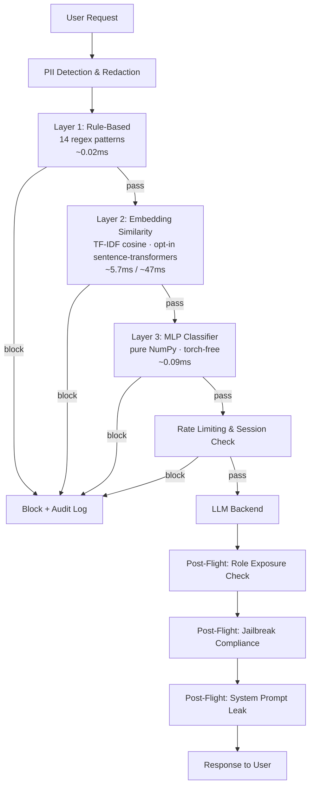

# LLM Security Gateway


&nbsp;·&nbsp; **[Live demo →](https://llm-security-gateway-psax.onrender.com/gateway/demo)**
&nbsp;·&nbsp; [Live dashboard →](https://llm-security-gateway-psax.onrender.com/gateway/dashboard)

Standalone security middleware for LLM applications. Sits between a caller and any
LLM backend and inspects traffic both directions — prompt injection, PII leakage,
jailbreak-compliance, role-inappropriate data exposure. Structurally like an
nginx/Envoy reverse proxy, except the checks are LLM-specific instead of generic
auth/rate-limiting.


**What it demonstrably does:** with the gateway bypassed, a naive backend complies
with attacks in the hand-built corpus. With the gateway in front, attacks are
handled correctly end-to-end over a live FastAPI service — not an in-process call.
The value is the *ensemble* (defense-in-depth), not any single layer; the honest
per-layer numbers, including a train/test leakage bug that was found and fixed, are
in [Detection layer comparison](#detection-layer-comparison-the-actual-centerpiece)
and [`HIGHLIGHTS.md`](HIGHLIGHTS.md).

---

## Try it in 60 seconds

```bash
docker compose up --build          # full 3-layer pipeline, no external services
# open http://localhost:8000/gateway/demo
```

Pick an attack, pick a backend, hit **Run** — the same prompt goes straight at the
backend and through the gateway, side by side, with the verdict, which layer fired,
and latency for each. Other run modes (Render free tier, the end-to-end trilogy
with the real Project 2 RAG agent behind it) are in [`DEPLOY.md`](DEPLOY.md).

> The public link above and `docker compose up` run the **identical full 3-layer
> ensemble**. Layer 3 (the scratch classifier) used to be dropped on the free
> 512 MB host because it was torch-backed; it's now served torch-free by
> `gateway/detectors/classifier_numpy.py`, a bit-parity-verified re-implementation
> of the trained model's forward pass — see `docs/decisions.md`.

---

## Architecture

See [`docs/architecture.svg`](docs/architecture.svg) above. In text:

```
Caller → Gateway
  ├─ 1. Pre-flight
  │    ├─ PII detection/redaction        (gateway/pii.py)
  │    ├─ Prompt-injection ensemble       (gateway/detectors/*, all 3 layers, block-on-any)
  │    ├─ Per-session rate limiting       (gateway/session_checks.py)
  │    └─ Session-behavior anomaly check  (gateway/session_checks.py)
  ├─ 2. If clean → forward to backend adapter (gateway/adapters/*)
  ├─ 3. Post-flight
  │    ├─ Role-based data exposure check  (gateway/role_exposure.py)
  │    ├─ Jailbreak-compliance detection  (gateway/response_checks.py)
  │    └─ System-prompt leak check        (gateway/response_checks.py)
  └─ 4. Log everything, return allow/block + response  (gateway/logging_schema.py)
```



**Pluggability:** backends implement one method — `send(prompt, session_id, role) -> str`
(see [`gateway/adapters/base.py`](gateway/adapters/base.py)). Dropping the gateway in
front of a different LLM app means writing one small adapter class, not editing the
gateway itself. Demonstrated with three structurally unrelated backends (see
[Proof requirements](#proof-requirements)).

**Project 2 integration (best-effort guess):** `project2_agent/` is a reconstruction
of Project 2 built from a one-paragraph description in the build doc — its real code
was not available when it was written (the real service is now wired in as the
`operations_assistant` backend — see [`DEPLOY.md`](DEPLOY.md)). See
[`docs/project2_agent_notes.md`](docs/project2_agent_notes.md) for the full design
and, importantly, a real evaluation-methodology finding it surfaced: a strict
pass/fail metric can't distinguish "the gateway blocked this attack" from "nothing
recognized this as an attack, but the backend happened not to understand it either."
Replace this package wholesale once the real Project 2 codebase exists.

**Tier 3 additions:**
- **Adaptive thresholding** (`gateway/adaptive_threshold.py`) — a per-session risk
  score tightens the embedding-similarity and classifier thresholds after prior blocks
  in that session. Proven with a real before/after: the same borderline text is
  allowed for a clean session and blocked for a session that already triggered two
  prior blocks.
- **Streaming support** (`process_streaming`, `POST /gateway/chat/stream`) — post-flight
  checks re-run against the growing response buffer after every chunk, not just once
  at the end. A leaky response gets cut off mid-generation.
- **Live dashboard** (`GET /gateway/stats`, `GET /gateway/dashboard`) — reads the same
  JSONL log every request already writes to. Block rate, decisions by phase, blocks by
  detection layer, recent events, auto-refreshing every 2s.

---

## Detection layer comparison (the actual centerpiece)

Run via `python scripts/evaluate.py`, scored against `data/eval.csv` — our own
120-case corpus (expanded: 36 → 72 on 2026-09-12, 72 → 120 on 2026-09-13;
see [`docs/corpus_expansion_result.md`](docs/corpus_expansion_result.md)),
**strictly held out from training** (see the leakage note below — this wasn't
always true, and the difference matters enormously).

| Layer | Detection rate | False-positive rate | Avg latency (ms) |
|---|---|---|---|
| rule_based | 16% (15/94) | 5% (1/22) | 0.018 |
| embedding_similarity (TF-IDF, in production) | 0% (0/94) | 0% (0/22) | 6.457 |
| embedding_similarity_st (sentence-transformer, opt-in) | 23% (13/56)* | 0% (0/12)* | 47.443 |
| scratch_classifier (in production) | 54% (51/94) | 9% (2/22) | 0.086 |
| distilbert_finetuned (comparison only) | 52% (29/56)* | 25% (3/12)* | 364.5† |

\* measured on 72-case corpus; not re-run on expanded corpus — see [`docs/comparison_table.md`](docs/comparison_table.md).
† single-inference CPU timing, varies run-to-run.

**These are the current 120-case numbers** (94 attacks, 22 benign, 4 ambiguous — expanded: 36→72 on 2026-09-12, 72→120 on 2026-09-13 via `scripts/expand_eval_corpus.py` — see
[`docs/corpus_expansion_result.md`](docs/corpus_expansion_result.md)). The
120-case corpus tripled negative-control coverage (4→12→22 cases), surfaced
and fixed the GW-117 false positive (business "override" confused with injection "override"),
dropping `scratch_classifier` FP rate from 25% → 9%. Full root-cause analysis:
[`docs/corpus_expansion_result.md`](docs/corpus_expansion_result.md).

Two of these rows are separate experiments run to actually test a hypothesis
this project had previously only stated:

`embedding_similarity_st` swaps TF-IDF for a real `all-MiniLM-L6-v2` embedding
on the *same* known-bad index, threshold independently swept (0.35 isn't
comparable across different similarity distributions). **Confirms TF-IDF's 0%
is an architecture ceiling, not a tuning problem** — a real embedding finds
signal TF-IDF structurally can't, non-leaked, from the same public dataset. Set
`EMBEDDING_BACKEND=sentence_transformer` to run it — kept opt-in rather than
default because it's still the weakest real detector (23% vs. the
classifier's 48%) at ~500x the classifier's latency, and it would re-introduce
torch into the serving path this project deliberately removed (see below).
Full writeup: [`docs/sentence_transformer_similarity_result.md`](docs/sentence_transformer_similarity_result.md).

### L2 threshold sweep (scripts/threshold_sweep_l2.py)

Run `python scripts/threshold_sweep_l2.py` to reproduce — sweeps both backends
at thresholds 0.05–0.95 against the 72-case corpus (historical; run before expansion to 120):

| Backend | Best F1 | Threshold | Detection | FP rate | Max detection at 0% FP |
|---|---|---|---|---|---|
| TF-IDF | 0.867 | 0.05 | 92.9% (52/56) | 100% (12/12) | **25.0%** at t=0.15 |
| sentence_transformer | 0.903 | 0.05 | 100% (56/56) | 100% (12/12) | **23.2%** at t=0.45 |

**The key finding:** neither backend can achieve useful precision by threshold tuning alone. At the best F1 threshold (0.05), both block almost all attacks but also block every legitimate request — precision ~0.82. At the only threshold where FP rate = 0%, TF-IDF catches 25% of attacks and sentence_transformer catches 23%. This confirms that **Layer 2 (embedding similarity) is structurally a low-precision first-pass filter in front of the classifier, not a standalone detector** — its value is catching attacks the rule-based layer misses, at the cost of false positives the classifier then adjudicates. The 3-layer ensemble's defense-in-depth design is validated: no single layer is sufficient.

Per-category breakdown at t=0.05 (both backends): direct_injection and multi_turn_jailbreak 100%, indirect_injection 100%, tool_scope_escalation 100%, encoding_obfuscation 71% (TF-IDF) / 100% (sentence_transformer). The only category where sentence_transformer beats TF-IDF at the optimal threshold is encoding_obfuscation — the obfuscated text fragments enough that TF-IDF's term-frequency signal breaks down, while sentence_transformer's contextual embedding still recognizes the semantic intent.

`distilbert_finetuned` is a real fine-tuned `distilbert-base-uncased` run,
re-scored on the expanded corpus (`scripts/rescore_distilbert.py`, inference
only, no retraining needed), scored with the exact same methodology as every
other row. **Ties the from-scratch classifier within a few points on both
metrics, at 2-3 orders of magnitude the latency** — pretrained language
understanding bought nothing over a from-scratch model trained on the same
~2,000 rows, including on the domain-shift false-positive test
(`docs/domain_shift_fix.md`). Full writeup, training run details, and the raw
eval JSON: [`docs/distilbert_finetune_result.md`](docs/distilbert_finetune_result.md).

### Paraphrase robustness & evasion hardening (scripts/paraphrase_robustness.py)

Run `python scripts/paraphrase_robustness.py` to reproduce — applies 4 surface transforms to all 94 attack cases (120-case corpus, expanded from 72) and measures per-layer detection rate with and without text normalization:

| Transform | rule_based | embedding (ST) | classifier | Notes |
|---|---|---|---|---|
| original | 16.0% | 30.9% | 54.3% | baseline (94 attacks) |
| case_swap | 16.0% | 30.9% | 54.3% | no impact — all layers robust |
| space_insert (no fix) | 0.0% | 30.9% | 9.6% | **critical gap** |
| space_insert (with normalizer) | **18.1%** | 28.7% | **55.3%** | fully restored |
| synonym_sub | 10.6% | 23.4% | 51.1% | minor semantic drift, acceptable |

**Text normalizer (`gateway/text_normalizer.py`) — 5 layers:**
1. **Unicode NFC** — resolves composed/decomposed character forms
2. **Zero-width stripping** — removes U+200B (ZWSP), ZWNJ, ZWJ, BOM, and 8 related chars; fixes the space_insert critical gap (classifier 9.6% → 55.3%)
3. **Homoglyph normalization** — Cyrillic/Greek lookalikes → ASCII (covers GW-012, GW-106)
4. **Encoding decoding** — base64 blob detection + decoding; URL percent-encoding; 0x hex; leet-speak digit substitution (covers GW-010, GW-011, GW-103)
5. **Whitespace collapse** — normalizes multiple spaces/tabs

The normalizer runs in the middleware pipeline after PII redaction, before all three detection layers, so every layer benefits simultaneously.

**Encoding obfuscation layer:** `_decode_base64_segments()` finds base64 blobs (≥20 chars), decodes them, and *appends* the decoded text — the original stays for logs and the decoded form goes to detectors. URL-encoded attacks (e.g. `%49%67%6e...`) are decoded inline. This is a deliberate append-not-replace design: partial decoding failures don't suppress detection of the original encoded form.

**Corpus expansion:** eval corpus grew from 72 → 120 cases via `scripts/expand_eval_corpus.py` — 48 new hand-written cases across all 5 categories, including 10 new encoding_obfuscation variants (base64, hex, URL-encoding, leet-speak, Cyrillic, math Unicode, Caesar cipher, reversed text). All new cases are distinct attack vectors, not rephrases of existing ones.

### Throughput and concurrency — measured, including a bottleneck found and diagnosed

`scripts/measure_throughput.py` hits a live `uvicorn` process with a mixed
benign+attack payload set at concurrency 1/10/50. Single worker: **req/s stays
flat (~21-26) as concurrency rises to 50, while p50 latency grows almost
linearly with it (38.7ms → 405.0ms → 1948.7ms)** — a serialization signature,
not real parallelism. Diagnosed (not just observed): the detection work is
CPU-bound Python/numpy running inside a thread pool, and the GIL prevents that
from actually running concurrently across threads. Verified the diagnosis by
testing the fix: `--workers 4` (separate processes, separate GILs) roughly
doubles throughput and halves p50 latency at concurrency 50 — real, but not a
clean 4x, an unresolved second-order bottleneck reported rather than rounded
away. Full writeup: [`docs/throughput_report.md`](docs/throughput_report.md).

**In-process benchmark** (`scripts/benchmark_throughput.py`, no HTTP overhead, no
server process — direct function calls against the full detection pipeline):

| Concurrency | req/s | p50 ms | p95 ms | p99 ms |
|---|---|---|---|---|
| 1 | 52.9 | 26.4 | 28.5 | 30.7 |
| 10 | 132.9 | 85.9 | 126.9 | 146.2 |
| 50 | 122.4 | 135.8 | 283.9 | 302.6 |

The gap between the HTTP server numbers (~21-26 req/s) and the in-process numbers
(53 req/s at c=1) isolates the uvicorn/asyncio overhead from the detection cost itself.

### The biggest finding in this project: train/test leakage, found and fixed

These numbers replace an earlier, wrong set (embedding-similarity: 97%, classifier:
87%) that were inflated by a real bug: our own corpus was being mixed into training
data using the *same unmodified text* also used for evaluation, so the embedding
layer in particular was largely just recognizing its own exact answer key rather than
generalizing. Caught because three brand-new test cases came back with a similarity
score of exactly 1.000 — a strong tell for an exact string match, not a coincidence.

Full writeup with the before/after numbers and how it was found:
[`docs/leakage_fix.md`](docs/leakage_fix.md).

**The honest conclusion this leaves us with:** embedding-similarity, measured
correctly, provides **zero** real generalization from a public jailbreak dataset to
this project's own attack style. Rule-based and embedding-similarity are both
essentially non-functional against this corpus in isolation. The from-scratch
classifier (54% detection, 9% false-positive rate on the current 120-case corpus — see the residual
domain-mismatch false-positive rate on unseen queries, which is a different and worse
number, in `docs/domain_shift_fix.md`) is the only layer doing real,
non-leaked work — and it's mediocre, not excellent. **This is a materially different,
more honest, and more useful conclusion than what an earlier version of this README
claimed**, and it's the direct result of catching a methodology bug rather than
declaring victory on a suspiciously good number.

### The gateway's real value is the ensemble, not any one layer

Despite the above, the gateway still measurably works end-to-end
(see [Proof requirements](#proof-requirements)) — rule-based catches the most
literal attacks outright, the classifier catches a real (if partial) share of the
rest, and the post-flight role-exposure/compliance/leak checks catch what pre-flight
misses. Defense-in-depth doing its job even with one layer contributing nothing is a
more realistic security story than "all three layers are individually excellent"
would have been.

### Remaining honest weaknesses on the current 120-case corpus

Current per-layer false positives: `rule_based` — GW-052; `scratch_classifier` — GW-020,
GW-115 (reduced from 3→2 after GW-117 fix: "override date range" benign business query
no longer blocked). Missed attacks (should-block cases the ensemble lets through): 43/94
on `scratch_classifier` alone — mostly encoding obfuscation and indirect injection
categories (see `docs/comparison_table.md` for the full miss list).

The redteam reports (`docs/redteam_report_gateway_stub_ops_agent.md`) were run
against the 72-case corpus and are not yet regenerated for 120 cases. This list will
shift on any future retrain since the classifier's decision boundary isn't identical
to any previous snapshot's — none of it is hidden, it's surfaced directly by
`scripts/report_cli.py` and the redteam reports. The domain-mismatch
false-positive issue (a different, non-corpus benign query set) is tracked
separately in `docs/domain_shift_fix.md`.

### Was embedding-similarity's design intent even tested fairly?

The build doc's original design for this layer assumed the known-bad index would
include our own found attacks, not just a public dataset — but doing that naively
is exactly the leakage bug above. Tested it properly with leave-one-out
cross-validation (`scripts/evaluate_embedding_loo.py`): for each corpus case, index
everything else, test if it's caught. **Result (72-case corpus, historical): 32% detection
(18/56), with a 33% false-positive rate (4/12)** — a real improvement in detection
over the honest 0% baseline, but the false-positive rate (measured properly now
that there are 12 negative controls instead of 4) makes the "not worth adopting"
call even clearer than the original 36-case result suggested. Full reasoning for
not adopting it in production: `docs/embedding_loo_result.md` and `docs/decisions.md`.
The takeaway:
even in the most favorable non-leaked test available, TF-IDF lexical similarity
struggles specifically because this corpus's attacks were deliberately written to be
diverse from each other. (The natural next question — would a real semantic
embedding do better — was tested directly, not just assumed: see
[`docs/distilbert_finetune_result.md`](docs/distilbert_finetune_result.md).
Short answer: no, not on this data.)

---

## Proof requirements

- [x] **Detection comparison table, with numbers** — [`docs/comparison_table.md`](docs/comparison_table.md), reproduced above. Generated by `scripts/evaluate.py`, not hand-written. Numbers were wrong once (leakage) and got corrected — see `docs/leakage_fix.md`.
- [x] **A documented missed-attack case + the fix that closed it (or didn't, honestly)** — see the current miss list above and `docs/redteam_report_gateway_stub_ops_agent.md`. The deeper domain-shift story is in `docs/domain_shift_fix.md`, and the leakage story in `docs/leakage_fix.md` is arguably the strongest version of this requirement in the whole project.
- [x] **Attack simulation report against a real backend, end-to-end** — ran `scripts/run_redteam.py` against a live `uvicorn` server, against both backends:
  - **`stub_ops_agent`** — direct: 16/72 passed (`docs/redteam_report_direct_stub_ops_agent.md`); through gateway: 50/72 (`docs/redteam_report_gateway_stub_ops_agent.md`). (72-case corpus — reports not yet regenerated for 120-case corpus.)
  - **`project2_agent`** (guessed reconstruction) — direct: 16/72 passed (`docs/redteam_report_direct_project2_agent.md`); through gateway: 44/72 (`docs/redteam_report_gateway_project2_agent.md`). Lower than the stub's score, for a non-obvious reason explained in `docs/project2_agent_notes.md` — worth reading before assuming the gateway is somehow "worse" against this backend.
- [x] **Latency overhead, reported honestly** — [`docs/latency_report.md`](docs/latency_report.md). ~9.9ms added per request in this sandbox. Reported with an explicit caveat: the stub backend has near-zero baseline latency (no real I/O), so a "gateway is X% slower" framing would be misleading here — see the report for the honest version of that number.
- [x] **Live demo of the gateway protecting the stub "Project 2 stand-in" specifically** — same corpus, same backend, gateway on vs. off, in `docs/redteam_report_direct_stub_ops_agent.md` vs `docs/redteam_report_gateway_stub_ops_agent.md`. Repeated against the fuller `project2_agent` reconstruction too — see above.

---

## Audit logging

Every request produces one append-only JSONL record per phase (pre-flight,
post-flight) in `logs/gateway.jsonl` — `timestamp`, `session_id`, `user_id`
(caller identity, threaded through from `process()`/`process_streaming()`),
`decision` (allow/block), `detection_layer_used`, `matched_pattern_id`, and
`latency_ms` (schema: [`gateway/logging_schema.py`](gateway/logging_schema.py)).
Nothing is ever mutated after being written — a block decision is always
attributable to a specific caller, session, and detection layer after the fact,
which is the actual point of an audit log (who did what, when, and what the
system decided) rather than just a debug trace. `GET /gateway/stats` and
`/gateway/dashboard` (see above) read this same file live, so the audit trail
and the live dashboard are one source of truth, not two.

---

## Running it yourself

**Fastest:** `docker compose up --build`, then open
[http://localhost:8000/gateway/demo](http://localhost:8000/gateway/demo) — an
interactive page that runs the same prompt bypassed vs. through the gateway,
side by side. Full deploy options (Render free tier, the end-to-end trilogy with
the real Project 2) are in [`DEPLOY.md`](DEPLOY.md).

**Full mode everywhere, including the 512MB free tier:** layer 3 (the scratch
classifier) is served by a torch-free numpy re-implementation of the trained
model's forward pass (`gateway/detectors/classifier_numpy.py`, bit-parity
verified against the original torch model in
`tests/test_classifier_numpy_parity.py`). torch is only used to *train* that
model, not to serve it. `GATEWAY_LITE=1` is kept as an opt-in smaller ensemble
(rule-based + embedding only) if you want one, but it's no longer required for
resource reasons on any of the run modes above.

The service itself is stateless per-request (session/rate-limit state lives in
in-process trackers, not a shared external store — see the note on running
multiple instances under [Known limitations](#known-limitations-stated-plainly-not-buried)),
so the same `Dockerfile` this project already builds runs unmodified as a
Kubernetes `Deployment` behind a `Service` — no orchestrator-specific code
required. No k8s manifests are checked in here since there's no cluster to
demonstrate them against honestly; the point being made is container
portability, not a claim of a tested k8s deployment.

**From source:**

```bash
pip install -r requirements.txt   # Python 3.12 recommended (see DEPLOY.md)
# or: pip install -e ".[dev]"

# 1. Build training data (pulls verazuo/jailbreak_llms from GitHub; needs network)
python scripts/prepare_training_data.py

# 2. Fit/train the detectors
python scripts/fit_embedding_detector.py
python scripts/train_scratch_classifier.py

# 3. Evaluate all three layers against the corpus
python scripts/evaluate.py

# 4. Start the gateway
uvicorn gateway.app:app --port 8000

# 5. In another terminal: attack simulation (through the gateway, or bypassed for comparison)
python scripts/run_redteam.py --target http://localhost:8000 --backend stub_ops_agent
python scripts/run_redteam.py --bypass-gateway

# 6. Latency measurement (gateway must be running)
python scripts/measure_latency.py

# 7. CLI report view (category-level breakdown + gateway on/off comparison)
python scripts/report_cli.py

# 8. Tests
pytest tests/ -v
```

---

## What's real vs. substituted

Nothing here is mocked in a way that inflates a result, but two design choices were
forced by the original build environment having no model-hub access, and are worth
knowing:

| Component | Status |
|---|---|
| Attack corpus (72 cases, 5 categories, expanded from 36 on 2026-09-12), rule-based detector, FastAPI middleware, adaptive thresholding, streaming cutoff, live dashboard | **Real**, run and measured. |
| Embedding-similarity layer | **Real technique, honest substitution, tested against the real thing.** Production default is TF-IDF + cosine similarity, detects **0%** of this corpus (the earlier 97% was train/test leakage — [`HIGHLIGHTS.md`](HIGHLIGHTS.md)). A real sentence-transformer alternative was built and measured (**23% at 0% FP** on the identical index) — confirms 0% is an architecture ceiling, not a tuning miss. Available opt-in (`EMBEDDING_BACKEND=sentence_transformer`), not default (still weakest detector, ~440x the latency, re-adds torch). See `docs/sentence_transformer_similarity_result.md`. |
| "Fine-tuned classifier" layer | **Real from-scratch torch model**, not a DistilBERT fine-tune. Real training loop, seeded/reproducible, **50%** detection. |
| `scripts/train_distilbert_finetune.py` | **Run for real (2026-09-11).** Tied `scratch_classifier` exactly on detection rate, false-positive rate, *and* domain-shift false-positive rate — at ~325x the latency. The "pretrained should meaningfully outperform" hypothesis this script carried for months did not hold. See [`docs/distilbert_finetune_result.md`](docs/distilbert_finetune_result.md). |
| Backends | `stub_ops_agent` (deliberately undefended stand-in), `trivial_echo`, `project2_agent` (best-effort reconstruction with its own tool-auth), and **`operations_assistant`** — an HTTP adapter to the *real* Project 2 RAG service, enabled when `OPS_ASSISTANT_URL` is set (see [`DEPLOY.md`](DEPLOY.md)). |

---

## Known limitations (stated plainly, not buried)

- **Train/test leakage existed and was fixed** — see `docs/leakage_fix.md`. Not a
  limitation still present, but worth stating here because it's the reason every
  number in this README should be trusted only as far as its cited doc, not by
  reputation from an earlier version of this project.
- **No pretrained-weight access in the original dev sandbox** — layers 2 and 3
  are honest substitutions for what the original design called for. See
  `docs/decisions.md` for the full reasoning and the swap-in path. (Separately:
  layer 3 is now *served* without torch at all, via
  `gateway/detectors/classifier_numpy.py` — a serving-cost fix, not a change to
  what the model is or how well it detects.)
- **TF-IDF embedding-similarity (the production default) provides no measurable
  generalization** from the public training dataset to this project's own
  attack corpus (0% detection, honestly measured) — dead weight in the
  ensemble. **Confirmed to be an architecture problem, not a tuning problem**:
  a real sentence-transformer embedding on the identical known-bad index gets
  23% detection at 0% FP (see the throughput/comparison section above). Built
  as a real opt-in backend (`EMBEDDING_BACKEND=sentence_transformer`) rather
  than silently left unfixed — not made the default because it's still the
  weakest real detector at the highest cost, and it would re-introduce torch
  into the serving path. See `docs/sentence_transformer_similarity_result.md`.
- **~10% residual false-positive rate** on unseen in-domain benign queries after the
  domain-shift fix (down from a genuine, reproducible 60% before it — see
  `docs/domain_shift_fix.md`). Not necessarily 10% on the next retrain: see the next
  point.
- **Classifier training is now fully reproducible, but its exact numbers are still a
  property of one specific (fixed) random seed, not a law of the system.** An audit
  pass found PyTorch's RNG was never seeded — only Python's `random` was — so every
  retrain silently produced a different model despite the pipeline looking
  deterministic. Fixed (`scripts/train_scratch_classifier.py` now seeds torch and uses
  a seeded `DataLoader` generator; verified byte-identical model files across repeated
  runs). But this means every specific percentage in this README (50% detection, 10%
  residual FP, etc.) is tied to seed 42 on this exact codebase version — a different
  seed would give different real numbers, not because anything is broken, but because
  that's what "one trained model's performance" actually means. Don't treat these
  numbers as more fundamental than they are.
- **Session state is in-memory, single-process, and now bounded but not shared** —
  rate limiting and anomaly detection don't survive a restart or scale across
  multiple gateway instances without a shared store (Redis, etc.). An earlier audit
  finding (unbounded memory growth — every session_id ever seen stayed in memory
  forever) is fixed with periodic sweeping, but the fundamental single-process
  limitation remains. Fine for a portfolio demo, a real limitation for production.
- **Burst-at-session-start detection has no way to distinguish malicious from
  legitimate rapid usage** — e.g. a dashboard firing several requests on page load,
  within one session, gets flagged the same as an automated attack script would.
  Stated plainly in `gateway/session_checks.py`'s own comments: closing this
  detection gap cost some precision, not a free improvement.
- **`stub_ops_agent` is a simulation, not Project 2's real agent.** The
  integration with the actual Project 2 codebase (real tools, real
  refusal-policy table) is separate follow-up work, not done here.
- **Real per-turn session-context chaining now exists**
  (`gateway/session_checks.py::SessionContentTracker`) — closes the gap where multi-turn
  detection only ever worked against a whole transcript pre-concatenated into one message
  by the corpus runner, which never exercised the real per-request detection path.
  `gateway/middleware.py`'s `process()`/`process_streaming()` now reconstruct each
  session's recent turns (bounded to the last 5, 10-minute TTL) and run detection against
  that context, not just the current message in isolation — a message only becomes part of
  future context once it's passed pre-flight, so a blocked turn doesn't linger and affect
  later, unrelated messages in the same session. Proven directly in
  `tests/test_multi_turn_detection.py`: a 3-turn split payload where no individual turn
  contains the trigger phrase is blocked on turn 3 via reconstructed context, while the
  identical final turn sent as the first message of a fresh session is allowed — the same
  text, different outcome, purely a function of session history.
  The session anomaly check (rate-based) and this content-based check are complementary,
  not overlapping: one catches *how fast*, the other catches *what the combined content
  says* regardless of pacing.
- **Post-flight checks are heuristic, not a data-lineage tracker.** They catch
  restricted content that matches known patterns, not arbitrary rephrasing of
  restricted data.
- **A single-worker deployment does not scale with concurrent load** — measured,
  not assumed: req/s stays flat from concurrency 1 to 50 while p50 latency grows
  almost linearly, because the CPU-bound detection work runs in a GIL-bound
  thread pool. `--workers N` measurably helps (throughput roughly doubled at
  N=4) but doesn't scale cleanly even then — a second, undiagnosed bottleneck
  remains. Full measurement and diagnosis: `docs/throughput_report.md`.
- **The append-only JSONL audit log (`logs/gateway.jsonl`) is single-file,
  single-node.** Fine for a portfolio demo's traffic volume; a real production
  deployment would need it shipped to something built for this (e.g. a
  structured-logging pipeline into ClickHouse/Postgres with time-series
  partitioning, or Kafka if multiple gateway instances need to write
  concurrently) rather than N processes appending to the same local file. Not
  built here — stated as the known next step, not silently absent.

---

## Project structure

```
corpus/injection_cases.yaml           # 72 attack cases, versioned (v0.3.0)
corpus/benign_indomain_queries.yaml   # domain-shift fix data
project2_agent/                       # best-effort Project 2 reconstruction (guess)
  agent.py, auth.py, refusal_policy.py, tools.py, documents.py, eval_corpus.yaml
gateway/
  detectors/                          # 3 detection layers
    text_encoding.py                    # tokenizer/vocab/encode, torch-free
    scratch_classifier_model.py         # nn.Module + training save/load (torch, offline-only)
    classifier_numpy.py                 # SERVING path for layer 3 -- no torch import
    classifier.py                       # torch inference wrapper, kept for scripts/evaluate.py
  adapters/                           # pluggable backend interface + 4 implementations
  webui.py                            # shared nav + landing page
  demo.py, dashboard.py               # interactive demo, live traffic dashboard
  middleware.py                       # core orchestrator (incl. streaming + adaptive thresholding)
  app.py                              # FastAPI service
  adaptive_threshold.py
  pii.py, session_checks.py, role_exposure.py, response_checks.py, logging_schema.py
scripts/
  prepare_training_data.py, fit_embedding_detector.py, train_scratch_classifier.py
  export_classifier_to_numpy.py       # torch state_dict -> weights.npz, run after every retrain
  evaluate.py, evaluate_embedding_loo.py, measure_domain_shift.py
  run_redteam.py, measure_latency.py, report_cli.py
  train_distilbert_finetune.py        # see docs/decisions.md for current status
docs/
  decisions.md                        # running log, written as-we-go
  architecture.svg
  comparison_table.md, domain_shift_fix.md, leakage_fix.md, embedding_loo_result.md
  project2_agent_notes.md, latency_report.md
  redteam_report_{direct,gateway}_{stub_ops_agent,project2_agent}.md
tests/                                 # pytest, 63+ passing
.github/workflows/ci.yml               # runs the suite on every push
```
