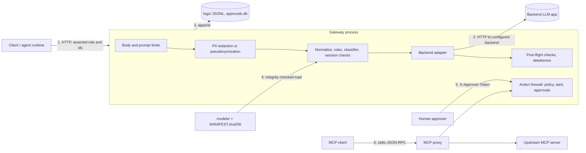

# Security policy and threat model

The gateway is a security control, so it is also an attack surface: it parses hostile input, holds session state, loads model files, and
sits between callers and a backend. This document says what it defends, what it does not, and where the gaps are. Every mitigation named
here has a test or a measurement behind it; where one does not, it says so.

## Reporting a vulnerability

Use GitHub's private vulnerability reporting: the repository's **Security** tab, then **Report a vulnerability**. Please do not open a
public issue for anything that works against a deployed instance. This is a portfolio project maintained by one person: expect an
acknowledgement within a few days and a fix or a written assessment on a best-effort basis. There is no bug bounty.

Only the `main` branch is supported; there are no release branches.

## What this project is, and is not

It is a middleware and a policy engine: pre-flight PII redaction and prompt-injection detection, post-flight response checks, and an
action firewall that authorizes an agent's tool calls. It is **not** an authenticated multi-tenant service. Identity (`role`, `user_id`,
`session_id`, the approver's name) is asserted by the caller and is not verified; that is the largest gap below and it shapes the
deployment advice. Detection is probabilistic: measured detection and false-positive rates are in the README, `docs/` and
`reports/redteam-2026-09.md`, and none of them is a guarantee.

## Assets and actors

| Asset | Why it matters |
|---|---|
| The decision to allow, block or hold a request or tool call | The product. A bypass is the failure. |
| PII in prompts, and the pseudonymization vault (`PII_MODE=pseudonymize`) | Personal data must not reach the backend or the logs; the vault holds originals in memory. |
| The audit log and the approval queue (`logs/`) | Evidence of what was decided and who approved it. |
| Model artifacts (`models/`), the tool policy (`config/tool_policies.yaml`) | Loading a swapped file changes what the gateway allows, and a pickle can run code. |
| Availability (a 512 MB free-tier instance) | A control that can be knocked over is bypassed by doing so. |
| The build and dependency chain | A compromised dependency runs inside the gateway. |

Actors: an anonymous internet client (the public demo), a user of a backend application, an attacker who controls a document an agent
reads (indirect injection), a hijacked agent, a malicious or careless operator, and a compromised dependency or CI action.

## Trust boundaries and data flow

Boundaries that matter: (1) the internet to the gateway, where every field is untrusted; (2) the gateway to the backend, where the backend
is trusted for availability but not for what it says; (4) the file system to the loader; (5) the approver's credential; (6) the MCP
transport, where the proxy cannot tell who is speaking.

## STRIDE for the gateway itself

"Fixed" and "Open" refer to this repository at the time of writing. Finding IDs: **RT-nn** are in `reports/redteam-2026-09.md`, **SEC-nn** in
`docs/security-scans.md`.

### Spoofing

| # | Threat | Mitigation in place | Status |
|---|---|---|---|
| S1 | A caller claims `role: admin` or another `user_id` / `session_id`; an approver claims a name. | Approvals need a shared `X-Approver-Token` and fail closed if it is unset (503); the requester cannot approve their own request. Nothing else. | **Open, by design.** No authentication of principals. Deploy behind an authenticating proxy that sets these fields and strips client-supplied ones. |
| S2 | A forged `X-Forwarded-For` header to dodge the per-IP limit. | The header is ignored unless `TRUSTED_PROXY_HOPS` says how many proxies to trust, and then the Nth entry from the right is used (RT-02; `tests/test_redteam_regressions.py`). | Fixed. The hop count must match the real proxy chain; `render.yaml` deliberately leaves it unset. |
| S3 | Rotating `session_id` to reset the rate limit. | A per-IP limit on top of the per-session one (RT-01). | Fixed. A distributed client is not stopped. |
| S4 | A caller steers the backend adapter to an attacker's URL (SSRF). | `backend` is a key into a fixed dictionary; backend URLs come only from operator environment variables; httpx verifies TLS. | No request-controlled URL exists. |
| S5 | Forged or replayed pseudonym tokens to read someone else's PII. | Tokens carry a per-session random nonce; a token from another session or a forged one does not resolve; the vault also binds a session to its creating `user_id` (`tests/test_pseudonymize.py`). | Mitigated. The `user_id` binding is only as strong as S1. |
| S6 | The MCP proxy's principal is whatever the launcher passes. | Documented; the proxy is meant to run beside a trusted agent. | **Open, by design** (stdio has no authentication). |

### Tampering

| # | Threat | Mitigation in place | Status |
|---|---|---|---|
| T1 | A model artifact or pickle is swapped (a pickle runs code on load). | SHA-256 of every served artifact is checked against `models/MANIFEST.sha256` before it is loaded; `MODEL_INTEGRITY=enforce` in both images and in CI (`gateway/model_integrity.py`, `tests/test_model_integrity.py`). Pickle loads are otherwise unchanged. | Mitigated. It detects change, not intent; whoever can edit the artifact can also edit the manifest, so the commit that touches it is the review point. |
| T2 | The tool policy is edited to widen access. | Default deny; validated on load, unknown keys raise. Reviewed like code. | Mitigated. It is operator-controlled by definition. |
| T3 | The gateway rewrites the caller's request before forwarding it. | The backend receives `sanitize()` output (removal only); the aggressive `normalize()` is for detection only (RT-09). | Fixed. |
| T4 | Instructions smuggled past detection: invisible tag characters, stacked combining marks, ROT13, Atbash, reversed text, bare hex, split identifiers. | RT-03, RT-04, RT-06 and the taint canonicalisation (RT-10, RT-11). | Mostly fixed. **Open:** latent injection inside quoted documents (RT-05), paraphrase and translation, confidential data from a trusted tool (RT-12). The approval gate is the backstop for tool calls. |
| T5 | A dependency, CI action or base image is tampered with. | Lock files with hashes, installed with `--require-hashes` (verified for the serving set against PyPI); actions pinned to commit SHAs; base image pinned by digest; Dependabot; `pip-audit` gate; SBOM per release. | Mitigated, with limits: the base image and PyPI are trusted at pin time, and a lock does not review the code it pins. |
| T6 | Invisible or bidirectional characters in source make code read differently than it runs (Trojan Source). | Bandit B613 found one in the normalizer; every such character is now a visible escape and `tests/test_source_hygiene.py` fails on any (SEC-03). | Fixed. |
| T7 | A hostile archive written outside its directory during a data download. | `safe_extract` validates every member (path escape, links) before extracting; https only (SEC-04; `tests/test_appsec_fixes.py`). | Fixed. |
| T8 | The approval database or the log is edited on disk. | File permissions only. | **Open.** See R1. |

### Repudiation

| # | Threat | Mitigation in place | Status |
|---|---|---|---|
| R1 | A decision or an approval cannot be attributed or its record cannot be trusted. | Every decision is logged (session, user, role, tool, effect, stage, reasons) and every approval records the approver id; PII is redacted in the audit record. | **Open.** Identities are asserted (S1), and the log is a plain file: not signed, no hash chain. Ship it to an append-only store. |
| R2 | Log records are lost silently. | Rotation no longer needs the file closed (Fix 4); a locked file is retried, then the batch is dropped and counted (`GatewayLogger.dropped`). | Partly. The counter is not exposed on an endpoint yet. |

### Information disclosure

| # | Threat | Mitigation in place | Status |
|---|---|---|---|
| I1 | PII reaches the backend or the logs. | Redaction by default (email, phone, card with Luhn, SSN with validity rules, Aadhaar with the Verhoeff checksum, PAN); or pseudonymization; the log records PII types, never values (`docs/pii-evaluation.md`). | Mitigated with measured recall limits: bare numbers with no context word are missed by design; names are not detected by default; PII in **responses** is not scanned. |
| I2 | Script injected through a logged field runs in the operator's browser (stored XSS). | Every interpolated field is escaped (RT-07, High; pinned by a test and verified in a browser). | Fixed. |
| I3 | Anyone can read the dashboard and stats. | None. `/gateway/dashboard` and `/gateway/stats` are unauthenticated: they show session ids, decisions and matched pattern ids. | **Open**, acceptable only for the public demo. Put them behind authentication. |
| I4 | The response carries detector internals that help an attacker tune inputs. | None: `/gateway/chat` returns a `trace` with per-layer results. | **Open**, intentional for the demo; remove or gate it for real use. |
| I5 | A secret in the repository or its history. | gitleaks on the full history in CI; `detect-secrets` locally; a manual scan of all 72 commits for 11 token formats found nothing; images exclude `.env`-style files and `logs/`. | Mitigated. gitleaks passes in CI (full history); it has not been run locally (see `docs/security-scans.md`). |
| I6 | The pseudonymization vault leaks originals. | In memory only, never logged or written; per-session, capped, expiring; not printed by `repr`. | Mitigated. A process memory dump would show it; it does not survive a restart. |
| I7 | System-prompt or role-restricted content in a response. | Post-flight checks (`role_exposure`, `system_prompt_leak`, jailbreak-compliance markers), including on streamed output. | Mitigated, heuristic; depends on the asserted role (S1). |

### Denial of service

| # | Threat | Mitigation in place | Status |
|---|---|---|---|
| D1 | One huge request exhausts memory or CPU. | The chat prompt is capped (20,000 characters), the identity fields are bounded, and every route has a body limit (256 KiB) that also stops chunked uploads (`gateway/limits.py`, `tests/test_limits.py`; SEC-01). Before this, nothing bounded a request. | Fixed. |
| D2 | A pathological string makes a pre-flight step super-linear. | The email pattern rescanned whole runs from every position: 270 ms for 20,000 characters, quadratic. A lookbehind made it linear (3 ms), and `tests/test_input_scaling.py` checks the scaling of every pre-flight step on 11 hostile shapes (SEC-02). | Fixed for the shapes tried; it is a test, not a proof. |
| D3 | Request flooding. | Per-session (20 per minute) and per-IP (120 per minute) limits (RT-01, RT-02). | Mitigated. Not distributed-proof; state is per process. |
| D4 | Per-session state grows without bound. | Session, context and adaptive trackers sweep by TTL; the action firewall, vault, taint index and approval queue have hard caps. | Mitigated. The log file itself has no size cap: rotate it externally (now possible). |
| D5 | The approval queue is flooded so real requests cannot be queued. | A cap on pending approvals: past it new writes are denied, not queued. | A deliberate trade: a flood can deny service to writes. |

### Elevation of privilege

| # | Threat | Mitigation in place | Status |
|---|---|---|---|
| E1 | A caller asserts a higher role to see restricted output or act as a manager. | Response filtering and the tool policy both use the asserted role. | **Open**; the same gap as S1. |
| E2 | A hijacked agent calls a tool, or a write, it should not. | Default-deny policy by role and argument; write tools always need human approval; taint tracking on write arguments (`docs/action-firewall.md`; 0 bypasses in 39 policy-enforced mutations). | Mitigated. Measured misses: paraphrase, translation, acronyms, trusted-tool data (all held for approval, none executed). |
| E3 | Code execution through the container. | Non-root user, no shell in the command path beyond `sh -c uvicorn`, digest-pinned base, hash-locked packages, `MODEL_INTEGRITY=enforce`. | Mitigated. CI builds the Render image and scans it (no fixed HIGH or CRITICAL finding; a blocking gate since 2026-09-26). The full-mode image with torch is not built anywhere yet, and nothing was run inside a container here. |
| E4 | Approving your own request or forging the approver. | Separation of duties in the queue; shared token; fails closed. | Mitigated only as far as the token is secret and the ids are honest (S1). |

## Attack surface

| Route | Auth | Notes |
|---|---|---|
| `POST /gateway/chat`, `/gateway/chat/stream` | none | per-IP limit, size limits, asserted identity |
| `GET /gateway/backends`, `/gateway/connectivity`, `/health` | none | reveal which backends are configured |
| `GET /gateway/demo`, `POST /gateway/demo/run`, `GET /gateway/demo/cases` | none | separate, tighter rate limit; runs the corpus |
| `GET /gateway/dashboard`, `/gateway/stats` | none | see I3 |
| `POST /gateway/actions/sources`, `/observe`, `/authorize` | none | meant for a trusted agent runtime; per-IP limit; exposed to anyone who can reach the port |
| `GET /gateway/actions/approvals[/{id}]`, `/policy` | none | read only |
| `POST /gateway/actions/approvals/{id}/approve`, `/deny` | `X-Approver-Token` | 503 if `GATEWAY_APPROVER_TOKEN` is unset |
| MCP proxy | none (stdio) | launched by the operator |

## Hardening checklist for a real deployment

1. Put an authenticating reverse proxy in front; have it set `role` / `user_id` and drop what clients send (S1, E1). Keep the dashboard, stats, demo and actions endpoints off the public side (I3, I4).
2. Set `TRUSTED_PROXY_HOPS` to the verified length of your proxy chain (S2), and `GATEWAY_APPROVER_TOKEN` to a long random value.
3. Keep `MODEL_INTEGRITY=enforce`; regenerate the manifest only in the commit that changes an artifact (T1).
4. Choose `PII_MODE` (`redact` is the default; `pseudonymize` keeps a vault in memory) and read `docs/pii-evaluation.md` for what is and is not detected (I1).
5. Ship `logs/` to an append-only store, rotate it, and alert on the block rate (R1, R2, D4).
6. Rebuild images regularly: the base image is pinned, so it does not update itself.

## Supply-chain controls

Hash-locked dependencies (`requirements*.lock`, refreshed with `scripts/update_locks.sh`), actions pinned to SHAs with least-privilege permissions, a
digest-pinned base image, a non-root runtime user, Dependabot, `pip-audit` (blocking), Bandit (blocking on `gateway/`), gitleaks, Semgrep and Trivy
(all blocking in CI; see the status table), and a CycloneDX SBOM per release (`.github/workflows/sbom.yml`). Guard tests keep these from drifting:
`tests/test_supply_chain.py`, `tests/test_source_hygiene.py`, `tests/test_model_integrity.py`.

## What has and has not been tested

Done: an adversarial exercise with garak, promptfoo, an LLM attacker and a mutation attacker (`reports/redteam-2026-09.md`); static analysis and
dependency audit (`docs/security-scans.md`); unit tests for every mitigation above.

Not done, and worth saying: no third-party penetration test; no fuzzing of the MCP proxy's transport (duplicate keys, encodings, oversize
frames); no load test of the limits under real traffic; Semgrep, Trivy and gitleaks ran only in CI, never locally, and their reports were not read beyond
pass or fail and Semgrep's annotated findings; the full-mode container image has not been built anywhere; the approver flow and the dashboard have no authentication to test.
