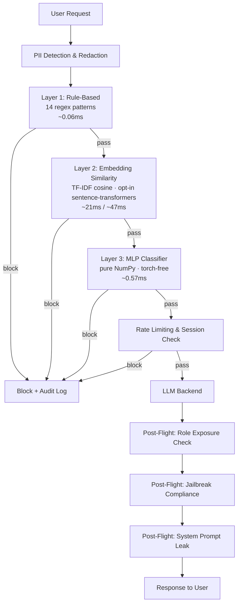

# Architecture notes (older text)

> Moved out of the README in Phase 7. Written incrementally during the build: numbers and status here may be older than the README, whose headline tables are generated from the current result files (`scripts/render_readme_headline.py`). Kept because the reasoning and the corrections are the point. The current architecture is in docs/architecture.md.

## Architecture

See [`docs/architecture.svg`](architecture.svg) above. In text:

```
Caller → Gateway
  ├─ 1. Pre-flight
  │    ├─ PII detection/redaction        (gateway/pii.py)
  │    ├─ Prompt-injection ensemble       (gateway/detectors/*, rule-based + classifier by default, block-on-any; TF-IDF layer opt-in)
  │    ├─ Per-session rate limiting       (gateway/session_checks.py)
  │    └─ Session-behavior anomaly check  (gateway/session_checks.py)
  ├─ 2. If clean → forward to backend adapter (gateway/adapters/*)
  ├─ 3. Post-flight
  │    ├─ Role-based data exposure check  (gateway/role_exposure.py)
  │    ├─ Jailbreak-compliance detection  (gateway/response_checks.py)
  │    └─ System-prompt leak check        (gateway/response_checks.py)
  └─ 4. Log everything, return allow/block + response  (gateway/logging_schema.py)
```



**Pluggability:** backends implement one method — `send(prompt, session_id, role) -> str`
(see [`gateway/adapters/base.py`](../gateway/adapters/base.py)). Dropping the gateway in
front of a different LLM app means writing one small adapter class, not editing the
gateway itself. Demonstrated with three structurally unrelated backends (see
[Proof requirements](project-notes.md#proof-requirements)).

**Project 2 integration (best-effort guess):** `project2_agent/` is a reconstruction
of Project 2 built from a one-paragraph description in the build doc — its real code
was not available when it was written (the real service is now wired in as the
`operations_assistant` backend — see [`DEPLOY.md`](../DEPLOY.md)). See
[`docs/project2_agent_notes.md`](project2_agent_notes.md) for the full design
and, importantly, a real evaluation-methodology finding it surfaced: a strict
pass/fail metric can't distinguish "the gateway blocked this attack" from "nothing
recognized this as an attack, but the backend happened not to understand it either."
Replace this package wholesale once the real Project 2 codebase exists.

**Tier 3 additions:**
- **Adaptive thresholding** (`gateway/adaptive_threshold.py`) — a per-session risk
  score tightens the embedding-similarity and classifier thresholds after prior blocks
  in that session. Proven with a real before/after: the same borderline text is
  allowed for a clean session and blocked for a session that already triggered two
  prior blocks.
- **Streaming support** (`process_streaming`, `POST /gateway/chat/stream`) — post-flight
  checks re-run against the growing response buffer after every chunk, not just once
  at the end. A leaky response gets cut off mid-generation.
- **Live dashboard** (`GET /gateway/stats`, `GET /gateway/dashboard`) — reads the same
  JSONL log every request already writes to. Block rate, decisions by phase, blocks by
  detection layer, recent events, auto-refreshing every 2s.

---
