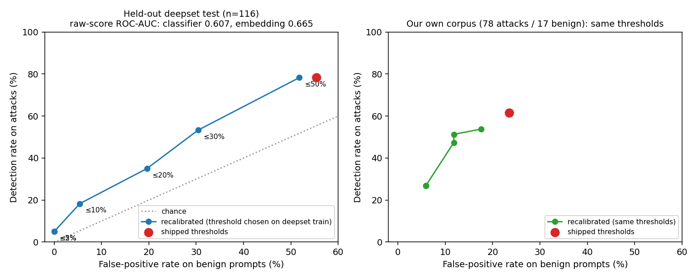

# From "97% external detection" to a measured trade-off: how the evaluation evolved

This records the sequence of steps, including the wrong turn, because the corrections are the
point. All numbers come from scripts in `scripts/` and raw JSON in `reports/`.

## Step 0: the claim we started with
`scripts/external_benchmark.py` scored the detectors on 150 prompts from jailbreak_llms and the
README reported **92% (embedding) / 97% (classifier)**, described as "independent of our
training data". A separate figure, "~10% residual false positives", came from hand-written
in-domain benign queries.

## Step 1: audit the claim (`scripts/external_benchmark_v2.py`)
`data/train.csv` is built from jailbreak_llms. An exact-match check (lowercased,
whitespace-normalised) found **422 of 666 prompts (63%) verbatim in the training positives**;
93 of the 150 in the old sample. On the contaminated prompts the layers score 100% / 97%, which
is memorisation. Result: the headline number was measuring the training set. It was withdrawn.

## Step 2: measure on independent data
| Data (not seen in training) | Detection | False positives |
|---|---|---|
| jailbreak_llms, 244 prompts not found in training | ensemble 94.7% | n/a |
| deepset/prompt-injections (663 rows: 263 injections, 399 benign) | ensemble 63.9% | **48.6%** |
| JailbreakBench benign requests (100) | n/a | **26.0%** |

Detection was worse than claimed, and the false-positive rate was the real problem: the
gateway would block a quarter to half of legitimate prompts from these distributions.

## Step 3: can recalibration fix it? (`scripts/recalibrate_thresholds.py`)
Idea: keep the models, move only the decision thresholds (classifier probability, embedding
similarity), choosing them on one dataset and testing on others.

Protocol: thresholds are chosen on the **deepset train split** (546 rows) by maximising
detection subject to a false-positive cap; everything else is held out: deepset test (116),
JailbreakBench benign (100), jailbreak_llms clean (244), and our own corpus (78 attacks,
17 benign) as a check on the domain the gateway was built for. Rule-based is binary and
unchanged; ensemble = block if any layer blocks.

Held-out results at each false-positive cap chosen on the calibration set (raw JSON:
`reports/p3_recalibration.json`):

| Cap on cal. FPR | deepset test: detection / FPR | JailbreakBench benign FPR | jailbreak_llms clean detection | Own corpus: detection / FPR |
|---|---|---|---|---|
| shipped thresholds | 78% / 55% | 26% | 95% | 62% / 24% |
| <= 50% | 78% / 52% | 27% | 95% | 54% / 18% |
| <= 30% | 53% / 30% | 12% | 91% | 51% / 12% |
| <= 20% | 35% / 20% | 9% | 88% | 47% / 12% |
| <= 10% | 18% / 5% | 0% | 66% | 27% / 6% |
| <= 5% | 5% / 0% | 0% | 64% | 27% / 6% |

## What we learned
1. **Recalibration removes false positives but pays for them in detection, almost one for
   one.** Getting deepset FPR near 5% leaves 18% detection; at zero false positives, 5%.
   There is no threshold that is both safe and effective on this data.
2. **The ceiling is the score quality, not the threshold.** Threshold-free, the classifier's raw
   score has ROC-AUC 0.61 on held-out deepset (embedding 0.67), barely above chance (0.5); on
   our own corpus it is 0.73 (embedding 0.48). No recalibration can beat those curves.
3. **The classifier learned jailbreak_llms-style text, not "injection" in general.** It looks
   good on data resembling its training set (jailbreak_llms clean: 95%) and poor elsewhere.
4. **Calibration data matters.** Thresholds picked on deepset generalised reasonably to the
   JailbreakBench benign set (same or lower FPR) but cost detection on our own corpus. A
   production gateway would calibrate on its own traffic, which we do not have.

## Caveats
- Small held-out sets (116 and 100 rows): the Wilson intervals in the JSON are wide, and the
  deepset test split's benign rate differs from its train split, so exact percentages move.
- deepset contains German text and some ambiguous labels; JailbreakBench "benign" requests
  are deliberately borderline.
- One calibration source and a single grid search; no cross-validation across datasets.
- Exact-match overlap checks miss near-duplicates, so the clean jailbreak_llms figures are
  upper bounds.

## Next step (not done here)
Improve the scores themselves: retrain the classifier with diverse external benign data
(and injection data other than jailbreak_llms), keeping deepset test, JailbreakBench and the
clean jailbreak_llms subset strictly held out, then re-measure this same table.
